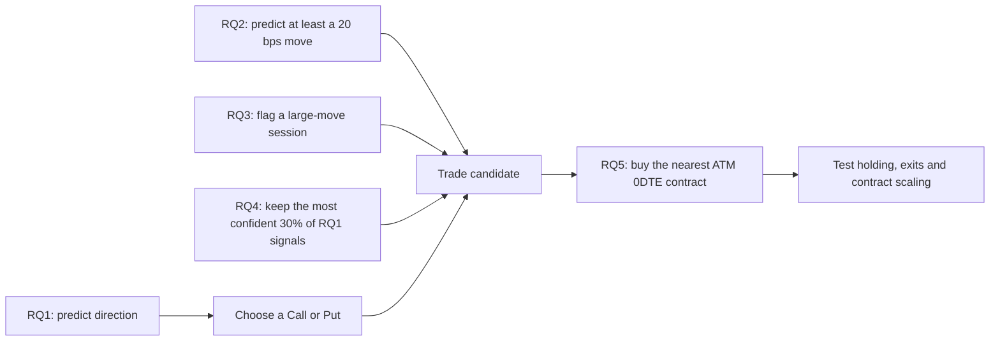

# Dissertation Trading Project

This repo is the practical side of my dissertation. I am looking at whether intraday SPX, SPY and VIX data can say anything useful about the final hour of SPX trading, and whether those signals still make sense once I apply them to 0DTE options.

## Repository structure

I split the project up like this:

```text
data/                    Raw and derived data used by the main analysis
data_extended_2023_2026/ Separate longer-history dataset
notebooks/               Main research notebooks
notebooks/legacy/        Older experiments kept to show how the work developed
scripts/                 Python helpers used by the notebooks
scripts/legacy/          Older browser-automation experiments
models/                  Saved models, once the model cells are run
outputs/                 Tables, plots, manifests and dissertation drafts
docs/notebooks/          One guide for each notebook
docs/scripts/            One guide for each Python script
docs/workflow.md          A map of the full workflow
config.yaml              Shared paths and timing settings
requirements.txt         Python packages used by the project
```

I made the notebooks look for `config.yaml` to find the project root. This means the `data/...` and `outputs/...` paths should still work whether Jupyter starts in the root folder or inside `notebooks/`.

## Setup

1. Create and activate a Python environment.
2. Install the packages with `pip install -r requirements.txt`.
3. Only run `playwright install chromium` if you want to try the old browser scripts.
4. Copy `main.env.example` to `main.env` and add the API details locally. The real `main.env` should never be committed.
5. Start Jupyter from the project root or the `notebooks/` folder.

The market data is large, so it stays in `data/`, `data_extended_2023_2026/` and `outputs/` rather than being installed as part of a Python package.

## Main workflow

The [workflow guide](docs/workflow.md) gives a diagram and links to the guide for every stage. If I need to rebuild the project, this is the order I follow:

1. `notebooks/01_massive_database_starter.ipynb` - check the API access and make sure the storage setup works.
2. `notebooks/02_massive_database_raw_retrieve.ipynb` - download the underlying and option data in restartable batches.
3. `notebooks/03_aligned_eda.ipynb` - line up SPY, SPX and VIX without looking forward.
4. `notebooks/04_cleaning_modellingprep.ipynb` - clean the sessions and make the chronological splits.
5. `notebooks/05_dataset_Splitting.ipynb` - create the strict and relaxed datasets on the same dates.
6. `notebooks/06_modeling_baseline.ipynb` - compare simple rules, dummy models and ML baselines for RQ1-RQ3.
7. `notebooks/07_hyperparameters_tuning.ipynb` - tune the shortlisted models with time-aware validation.
8. `notebooks/08_hyperparameters_tuning_extended_robustness.ipynb` - check benchmarks, regimes, feature stability and confidence coverage.
9. `notebooks/09_probe_massive_2021_2022_underlying_access.ipynb` - check whether older 2021-2022 data is available before extending the history.
10. `notebooks/10_extended_2023_2026_full_pipeline.ipynb` - repeat the underlying pipeline on the separate longer history.
11. `notebooks/11_lstm_intraday_sequence_extension.ipynb` - try the smaller LSTM sequence experiment.
12. `notebooks/12_rq4_economic_meaningfulness.ipynb` - check whether the signals pick out more useful SPX moves.
13. `notebooks/13_rq4_economic_meaningfulness_extended.ipynb` - repeat that RQ4 check on the longer history.
14. `notebooks/14_rq5_options_data_retrieval.ipynb` - lock the dates and download the required option bars.
15. `notebooks/15_rq5_options_backtest.ipynb` - run the fixed ATM strategy and mean-reversion comparison.
16. `notebooks/16_rq5_exit_strategy_sensitivity.ipynb` - check the planned stop, target and other exit rules.
17. `notebooks/17_rq5_strategy_robustness_and_multi_contract.ipynb` - look at concentration, path behaviour and multi-contract examples.

Everything under `notebooks/legacy/` has its own separate numbering and is kept as background rather than final dissertation evidence.

## Checks I kept in place

- Features only use information available before the 15:00 ET decision time.
- SPX and VIX are matched backwards, not to a later minute.
- Train, Validation and Test are kept in date order.
- Imputation, clipping, scaling, regime cut-offs and model selection are fitted inside the relevant training data.
- I don't describe an already-viewed test result as if it were a fresh test.
- The RQ5 trading and cost rules are fixed before any future holdout is used.

## Documentation and outputs

Every notebook and executable script has its own guide under `docs/notebooks/` or `docs/scripts/`. The guides explain what I was trying to do, what went in, what came out and what I would do next. The actual saved evidence stays under `outputs/`. The planned model filenames are listed in [models/README.md](models/README.md).

The two tuning notebooks can save the chosen RQ1-RQ3 classical models with `SAVE_MODEL_ARTIFACTS`. The LSTM notebook has the same switch for its exploratory refits and scalers. I haven't included the binary model files in this documentation change; they appear when those cells are actually run.

The main things to keep in mind are the small daily sample, changing market conditions, missing historical option quotes, made-up execution penalties and the lack of a completely fresh post-selection holdout so far.

## Results: how a signal became a trade

I did not make a trade just because one model predicted the market would go up or down. A session only reached the RQ5 backtest when the earlier research questions agreed that it was worth looking at:



RQ1 decided the direction: an upward prediction became a Call and a downward prediction became a Put. RQ2 and RQ3 acted as filters for the size of the opportunity, while RQ4 checked whether the combined signal picked out more economically meaningful final-hour moves. I froze those rules before checking the option result. This left 17 usable trades, entered between 15:00 and 15:05 ET and normally closed between 15:55 and 15:59 ET.

### A mix of strategy results

These examples are all from the same 17 historical opportunities. I have included the main one-contract result, alternative exits, multi-contract ideas and loss-making cases rather than only showing the best performers.

| Type | Strategy | What I tested | Total P&L | Win rate | Median premium at risk |
|---|---|---|---:|---:|---:|
| One contract | ATM hold to close | Buy one ATM contract in the RQ1 direction and hold it to the normal close. | $9,551 | 64.7% | $947 |
| One contract | -50% stop / +100% target | Close the trade when either the stop or target is reached. | $3,026 | 52.9% | $947 |
| Two contracts | +100% target with break-even runner | Sell one contract at +100%, then move the second contract's stop to break-even. | $11,730 | 52.9% | $1,893 |
| Three contracts | +50% / +100% scale-out | Sell one at +50%, one at +100%, then hold the last contract to the close. | $12,556 | 52.9% | $2,839 |
| Losing case | RQ1 ML, 30-point OTM, medium costs | Use a cheaper contract farther out of the money under the main cost assumption. | -$19 | 11.8% | $127 |
| Losing case | Mean reversion, 30-point OTM, severe costs | Use the simple direction benchmark with the cheapest tested strike and harsher execution costs. | -$562 | 11.8% | $137 |

The main one-contract ATM trade was the clearest result in this sample. The multi-contract versions made more raw dollars, but they also put roughly two or three times as much premium at risk and did not beat simply holding the same number of contracts to the close. The losing OTM examples are important too: lowering the entry cost made near-total losses much more common, and harsher execution costs pushed the result further below zero. With only 17 trades and synthetic cost assumptions, I treat all of this as development evidence rather than proof of a profitable live strategy.

The figures come from the [RQ5 backtest rules](outputs/rq5_options_trading/rq5_backtest_manifest.json), [one-contract and strike results](outputs/rq5_options_trading/tables/rq5_strategy_summary.csv), [exit-policy results](outputs/rq5_options_trading/tables/rq5_exit_policy_primary_atm_medium_cost.csv) and [multi-contract results](outputs/rq5_options_trading/tables/rq5_multi_contract_summary.csv).
