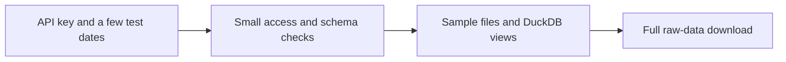

# 01 - Testing the Massive API and Local Database Setup

**File:** [notebooks/01_massive_database_starter.ipynb](../../notebooks/01_massive_database_starter.ipynb)

**How I use it:** This is the small test notebook I run before committing to a long download.

## The short version

This notebook is basically my plumbing check. I use a few small requests to make sure the API key works, see which endpoints the subscription actually allows, and confirm that Parquet and DuckDB are saving things in the layout expected by the later notebooks. If this one fails, there is no point starting notebook 02 and hoping for the best.

## Where it sits in the workflow

Nothing from here is treated as a modelling result. It is an early warning system for account permissions, schema changes and local storage problems.

## What it needs

- `main.env`, which supplies `MASSIVE_API_KEY` without putting it in the notebook.
- A deliberately small set of recent dates and tickers.
- The Massive aggregates, option-contract and snapshot endpoints.
- The helper functions in `scripts/massive_database.py`.

## What I actually do here

I keep the requests small on purpose. The aim isn't to collect the study here; it is to find problems cheaply before a long run.

- I probe SPY, SPX and VIX aggregates and print enough of the response to check the fields and timestamps.
- I try the option endpoints separately because an account can have underlying data access without the historical option data I need.
- I normalise a small sample, write it to the same partitioned layout used later, and check that DuckDB can register and query it.
- I leave empty responses and entitlement errors visible. I don't turn them into fake zero-row successes.

When I come back to the project after a break, this is also the quickest place to check whether a subscription or API behaviour has changed.

## What it creates

- Small test partitions under `data/raw/`.
- The local database at `data/market.duckdb`.
- Displayed endpoint checks and ingestion-log rows inside the notebook.
- A confirmed storage path that the full retrieval notebook can reuse.

## Outputs worth opening

The most useful files to open after the test are the [local DuckDB database](../../data/market.duckdb) and the [underlying session audit](../../data/derived/underlying_session_audit.parquet). The audit is produced further downstream, but it is the easiest way to see whether the storage setup tested here eventually produced complete sessions.

I also check the notebook's displayed contract and snapshot samples. They are more useful than a screenshot because I can see the exact returned columns, the ticker format and any entitlement message.

## What I took from it

- The account can expose different amounts of history for underlyings, contracts and option bars, so I test them separately.
- A successful HTTP response is not enough; I also need rows, sensible timestamps and a file that can be queried again.
- Keeping one shared storage pattern here stopped the later notebooks from inventing their own folder structures.

## Things I wouldn't overclaim

- This only checks a handful of dates. It cannot prove that every historical session is available or complete.
- Massive access depends on the subscription and rolling history window, so an old successful run does not guarantee the same result today.
- The notebook checks retrieval and storage, not whether the data is economically useful.

## What I run next

If the probes, saved sample and DuckDB query all look normal, I move to [02 - raw retrieval](02_massive_database_raw_retrieve.md). If they do not, I fix the access or schema issue here instead of debugging it halfway through the main download.
