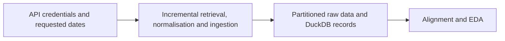

# Massive Raw Data Retrieval

**Executable:** `notebooks/02_massive_database_raw_retrieve.ipynb`
**Status:** I use this in the main dissertation workflow.

## Purpose

This notebook does the longer data download. I use it to collect the underlying history and the option samples in small restartable pieces instead of relying on one very long API call.

## Workflow

## Inputs

- `main.env` with `MASSIVE_API_KEY`
- Massive API
- Retrieval dates and ticker configuration

## Processing and rationale

- I request SPY, SPX and VIX minute data one business day at a time.
- I standardise the timestamps, save each day as Parquet and register the files in DuckDB.
- For options, I find the SPX contracts first, then save whatever snapshots or minute samples the account can return.

## Outputs

- `data/raw/`
- `data/market.duckdb`
- DuckDB ingestion log

## Representative outputs

The maintained downstream audit is stored as [underlying session audit Parquet](../../data/derived/underlying_session_audit.parquet), while the raw retrievals remain in date-partitioned files below `data/raw/`.

## Findings and decisions

- Completed ticker-date requests are logged, so rerunning the notebook doesn't download the same day again.
- Errors and empty days stay visible in the log. I don't silently count them as good data.

## Limitations

- This setup couldn't backfill historical Greeks, open interest or full quote-level spreads.
- A long download can still be interrupted by the API plan, rate limits or the internet connection.

## Next steps

- Once the required underlying views exist, I can move on to alignment and EDA.
