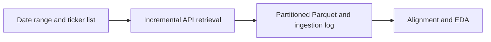

# 02 - Raw Market Data Retrieval

**File:** [notebooks/02_massive_database_raw_retrieve.ipynb](../../notebooks/02_massive_database_raw_retrieve.ipynb)

**Role in the project:** This is the main collection notebook. Its saved raw history is reused by the downstream preparation stages.

## Overview

This notebook performs the full underlying-data retrieval. It collects SPY, SPX and VIX one day at a time, saves each ticker-date separately, and records each result so the process can be restarted safely. A day-by-day approach is used because a single large request would be more difficult to audit and repeat after an internet or API interruption.

## Workflow

This is still a raw-data stage. I standardise the provider fields and timestamps, but I do not create model features or apply session exclusions at this stage.

## Inputs

- `main.env` with the Massive API key.
- The date range and SPY, `I:SPX` and `I:VIX` ticker settings.
- The local raw-data root and `data/market.duckdb`.
- The reusable retrieval and normalisation functions from `scripts/massive_database.py`.

## Processing

The main practical objective is to make the download restartable while retaining a clear audit trail for missing days.

- I request one business day per ticker rather than assuming every weekday is a complete market session.
- Each response is converted to the same column names, with UTC kept as the main timestamp and New York time added for session filtering.
- A completed partition is skipped on the next run unless I explicitly choose to replace it.
- Empty responses, holidays, permission failures and request errors are kept in the ingestion log.
- For options, I discover dated contracts first and only then request bars for the contracts that are actually in scope.

Incomplete days are not cleaned at this stage. The following audit and alignment notebooks need the original returned data so that later exclusions remain traceable.

## Outputs

- Date-partitioned underlying and option files below `data/raw/`.
- DuckDB views and ingestion records in `data/market.duckdb`.
- Raw provider fields converted into a consistent Parquet schema.
- Visible logs for downloaded, existing, empty and failed ticker-date requests.

## Key outputs and figures

The [market database](../../data/market.duckdb) provides the main query layer, while the [underlying session audit](../../data/derived/underlying_session_audit.parquet) records the coverage checks produced by notebook 03. The raw partitions below [`data/raw/`](../../data/raw/) allow individual dates to be inspected without loading the complete history.

The ingestion log displayed in the notebook is important as well. It tells me whether a missing session is a market holiday, an empty API reply or an actual failed request instead of mixing all three together.

## Findings and decisions

- Restartable daily partitions were much easier to manage than one large download.
- The underlying history was more complete than the historical option metadata such as Greeks, implied volatility and open interest.
- Keeping empty and failed dates visible made the later strict/relaxed rules defensible rather than arbitrary.

## Limitations and considerations

- A provider can return trades outside the regular session, so row counts in the raw files are not the same as the 390 modelling minutes.
- The API plan, rate limits and rolling history window can interrupt or restrict a rerun.
- Raw trade aggregates do not give historical NBBO spreads.

## Next stage

Once the required SPY, SPX and VIX partitions are present, I move to [03 - alignment and EDA](03_aligned_eda.md). I do not start modelling directly from these raw files.
