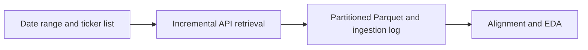

# 02 - Downloading and Storing the Raw Market Data

**File:** [notebooks/02_massive_database_raw_retrieve.ipynb](../../notebooks/02_massive_database_raw_retrieve.ipynb)

**How I use it:** This is the main collection notebook, so I normally leave it alone once the required raw history is saved.

## The short version

This is the long downloader. It collects SPY, SPX and VIX one day at a time, saves each ticker-date separately, and records what happened so I can safely restart it. I chose the slower day-by-day approach because one giant request is hard to audit and painful to repeat when the internet or API plan interrupts it.

## Where it sits in the workflow

This is still a raw-data stage. I standardise the provider fields and timestamps, but I do not create model features or silently remove awkward sessions here.

## What it needs

- `main.env` with the Massive API key.
- The date range and SPY, `I:SPX` and `I:VIX` ticker settings.
- The local raw-data root and `data/market.duckdb`.
- The reusable retrieval and normalisation functions from `scripts/massive_database.py`.

## What I actually do here

The main practical job is making the download restartable and leaving an honest trail of missing days.

- I request one business day per ticker rather than assuming every weekday is a complete market session.
- Each response is converted to the same column names, with UTC kept as the main timestamp and New York time added for session filtering.
- A completed partition is skipped on the next run unless I explicitly choose to replace it.
- Empty responses, holidays, permission failures and request errors are kept in the ingestion log.
- For options, I discover dated contracts first and only then request bars for the contracts that are actually in scope.

I deliberately avoid cleaning incomplete days here. The following audit and alignment notebooks need to see what was really returned so the exclusions stay traceable.

## What it creates

- Date-partitioned underlying and option files below `data/raw/`.
- DuckDB views and ingestion records in `data/market.duckdb`.
- Raw provider fields converted into a consistent Parquet schema.
- Visible logs for downloaded, existing, empty and failed ticker-date requests.

## Outputs worth opening

I normally check the [market database](../../data/market.duckdb), then open the [underlying session audit](../../data/derived/underlying_session_audit.parquet) once notebook 03 has built it. The raw partitions themselves sit below [`data/raw/`](../../data/raw/), which is useful when one date needs to be inspected without loading the whole history.

The ingestion log displayed in the notebook is important as well. It tells me whether a missing session is a market holiday, an empty API reply or an actual failed request instead of mixing all three together.

## What I took from it

- Restartable daily partitions were much easier to manage than one large download.
- The underlying history was more complete than the historical option metadata such as Greeks, implied volatility and open interest.
- Keeping empty and failed dates visible made the later strict/relaxed rules defensible rather than arbitrary.

## Things I wouldn't overclaim

- A provider can return trades outside the regular session, so row counts in the raw files are not the same as the 390 modelling minutes.
- The API plan, rate limits and rolling history window can interrupt or restrict a rerun.
- Raw trade aggregates do not give historical NBBO spreads.

## What I run next

Once the required SPY, SPX and VIX partitions are present, I move to [03 - alignment and EDA](03_aligned_eda.md). I do not start modelling directly from these raw files.
