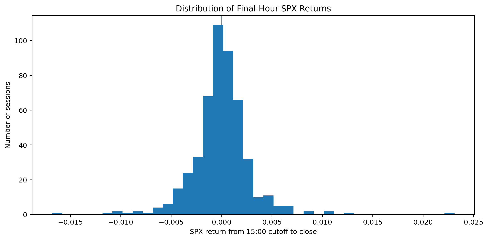

# 03 - Aligned Data and Exploratory Analysis

**File:** [notebooks/03_aligned_eda.ipynb](../../notebooks/03_aligned_eda.ipynb)

**Role in the project:** This is the maintained EDA notebook and the first place where the daily modelling table is built.

## Overview

This notebook turns three separate minute feeds into one timeline. SPY acts as the clock and I only attach SPX or VIX observations that were already available at that minute. After that I build the pre-15:00 features and spend time looking for incomplete sessions, strange values and patterns that might matter later. It is the main reference for tracing how each feature is constructed.

## Workflow

The timing choice is more important than the visual presentation. A forward or nearest match could introduce a future index value, so the alignment is deliberately backward-only.

## Inputs

- Underlying views registered in `data/market.duckdb`.
- SPY, SPX and VIX one-minute observations.
- Regular-session timing rules and the 14:59 feature cutoff.
- The two-minute maximum staleness rule.

## Processing

I do three jobs in the same notebook because they depend on the same aligned minute table.

- I filter the regular session and use each SPY minute as the left-hand clock.
- SPX and VIX are merged backwards, never forwards, and I record how stale each match is.
- I count bars and missing matches by session before deciding that a day is usable.
- I build returns, realised-volatility, volume, VWAP, range-position and ATR-style features using information no later than 14:59 ET.
- The target is the SPX movement from the completed 14:59 bar to the completed 15:59 bar.
- Finally, I plot distributions, time behaviour, correlations and class balance to see what sort of modelling problem I actually have.

Most relationships are weak, which is important context for interpreting the later modelling results.

## Outputs

- `data/derived/aligned_underlyings_1min.parquet`.
- `data/derived/underlying_session_audit.parquet`.
- `data/derived/daily_underlying_model_dataset.parquet`.
- Fifteen EDA figures under `outputs/eda_figures/`.

## Key outputs and figures

*This is the first plot I check because it shows whether the backward matches are genuinely close to the SPY minute.*

*This makes the small moves and the much rarer tails easier to see, which matters for both RQ2 and RQ3.*

*This provides a descriptive view of feature relationships. It does not imply that a feature causes the final-hour move.*

The [daily modelling dataset](../../data/derived/daily_underlying_model_dataset.parquet) is the useful file when I want to trace a plotted point back to the actual row.

## Findings and decisions

- The saved run contained 194,495 aligned minutes, 501 audited sessions and 496 daily modelling rows.
- The timing and target-reconstruction checks passed without making new API calls.
- Most individual feature correlations with the final-hour return were weak, so later gains need to be judged against simple rules and chronological validation.
- The session audit showed why a simple weekday count would have overstated the usable sample.

## Limitations and considerations

- A backward match may still be up to two minutes old, so aligned does not mean perfectly synchronous.
- EDA uses the available sample and can reveal patterns that fail later.
- The ATR measure is an intraday mean true range, not the usual fourteen-day technical indicator.

## Next stage

I take the aligned daily table and its session audit into [04 - cleaning and modelling preparation](04_cleaning_modellingprep.md), where exclusions and preprocessing decisions are written down properly.
