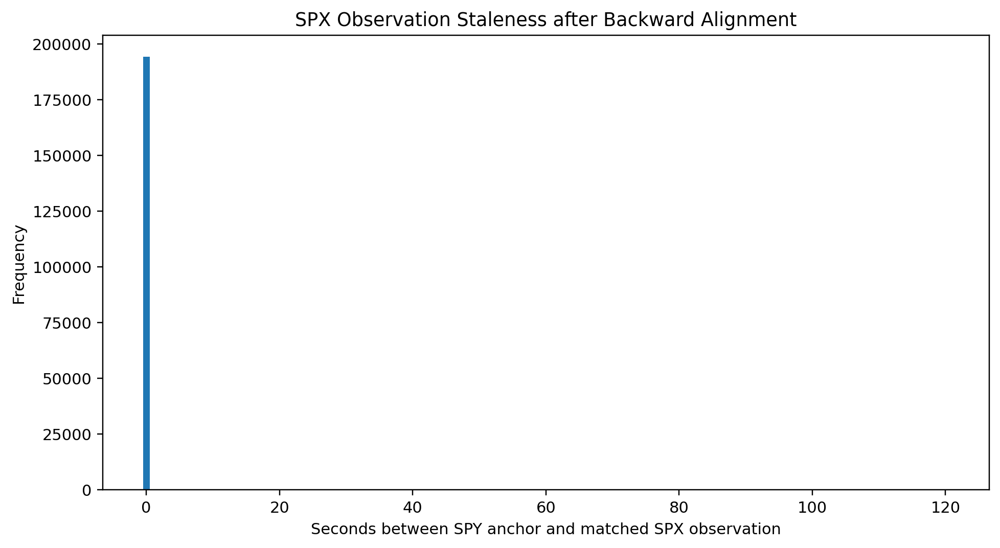
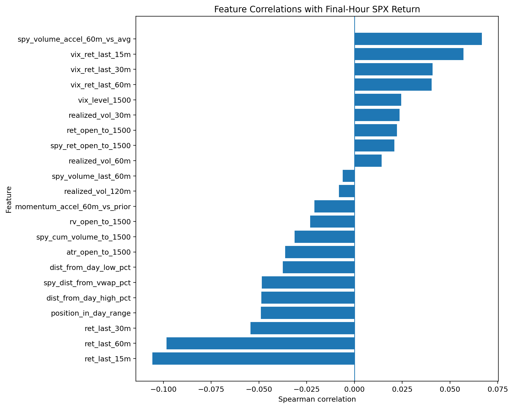

# Look-Ahead-Safe Alignment and Exploratory Data Analysis

**Executable:** `notebooks/03_aligned_eda.ipynb`
**Status:** I use this in the main dissertation workflow.

## Purpose

This is where I line up the SPY, SPX and VIX minute data and build the daily table I use later on. The main thing I wanted to avoid here was accidentally matching a row with information that wasn't available yet.

## Workflow

## Inputs

- `data/market.duckdb`
- SPY, SPX and VIX one-minute observations

## Processing and rationale

- I use SPY as the minute-by-minute clock, then match SPX and VIX backwards within a two-minute window.
- I check whether each trading session looks complete and only build features from bars before 15:00 ET.
- I then look through the distributions, missing values, class balance and basic correlations to get a feel for the data.

## Outputs

- `data/derived/aligned_underlyings_1min.parquet`
- `data/derived/underlying_session_audit.parquet`
- `data/derived/daily_underlying_model_dataset.parquet`
- `outputs/eda_figures/`

## Representative outputs

*This plot shows the age of backward-looking SPX matches, used to confirm that the alignment is timely without looking forward.*

*This plot shows the univariate relationships that guided later modelling while remaining descriptive rather than causal.*

## Findings and decisions

- When I ran it, I ended up with 194,495 aligned minute rows. That covered 501 checked sessions and 496 sessions in the daily modelling table.
- Most of the single-feature correlations with the final-hour return were weak. Because of that, I don't treat the EDA as proof that the market is predictable.
- The look-ahead checks passed, and this stage didn't need to make any new Massive API calls.

## Limitations

- A match can still be slightly stale, even though it falls inside the two-minute limit.
- These plots only show what is in this sample. They don't tell me how well a model will work on later data.

## Next steps

- Next I need to review the awkward sessions, remove partial days and lock in the chronological splits.
