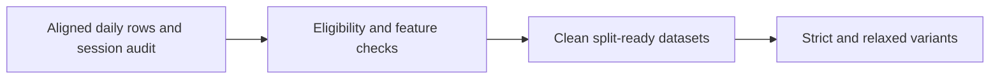
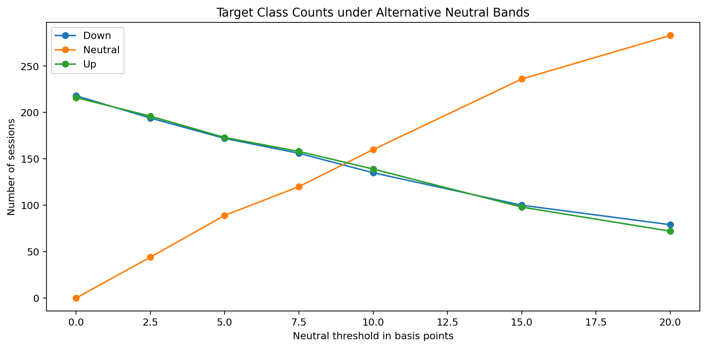

# 04 - Cleaning the Daily Dataset Before Modelling

**File:** [notebooks/04_cleaning_modellingprep.ipynb](../../notebooks/04_cleaning_modellingprep.ipynb)

**How I use it:** I use this to make the cleaning choices visible and to stop preprocessing from leaking later dates backwards.

## The short version

This is the tidy-up notebook. It reviews which sessions are genuinely usable, checks the feature definitions again, and creates the clean chronological datasets. The useful part is not just that rows are removed; it is that there is a table showing why each one was kept or rejected.

## Where it sits in the workflow

I keep this separate from modelling so a changed score cannot tempt me to quietly change the cleaning rule afterwards.

## What it needs

- `data/derived/daily_underlying_model_dataset.parquet`.
- `data/derived/underlying_session_audit.parquet`.
- The intended chronological Train, Validation and Test boundaries.
- The feature-timing and target definitions from notebook 03.

## What I actually do here

I work through the boring checks here because they are exactly the things that can create a believable but invalid result later.

- I remove duplicates, partial sessions, early closes and rows where the feature or target timestamps are not in the right order.
- I check missing and infinite values, constant columns and highly correlated feature pairs.
- I reconstruct the target from the saved SPX prices so I am not trusting a previously calculated column blindly.
- Clipping and imputation values are learned from training rows only, then carried forward to later rows.
- I compare plausible neutral-return thresholds but keep the final target definition explicit instead of choosing one because it improves a model.

The model-ready file is convenient, but the later pipelines still keep preprocessing inside the training folds where possible.

## What it creates

- `data/derived/daily_underlying_model_dataset_clean.parquet`.
- `data/derived/daily_underlying_model_dataset_clean_split.parquet`.
- `data/derived/daily_underlying_model_dataset_model_ready.parquet`.
- Cleaning audits, parameters and a manifest under `outputs/cleaning/`.

## Outputs worth opening

*This shows how quickly the direction classes change when I call very small returns neutral.*

The [session eligibility review](../../outputs/cleaning/session_eligibility_review.csv) is the practical file for seeing which dates were removed and why. The [feature-definition review](../../outputs/cleaning/feature_definition_review.csv) records how each less-obvious feature was interpreted, while the [training preprocessing parameters](../../outputs/cleaning/training_preprocessing_parameters.csv) show the values learned without looking at Validation or Test. The final choices are summarised in the [cleaning manifest](../../outputs/cleaning/cleaning_manifest.json).

## What I took from it

- The strict binary-target table retained 434 sessions in the saved run.
- Duplicate, target-formula and look-ahead checks passed.
- Several features were highly correlated, which reinforced the decision to keep transformation and model fitting together inside validation.
- Writing an eligibility table made the loss of sample size much easier to explain than a single cleaned-row count.

## Things I wouldn't overclaim

- Strict cleaning reduces an already small daily sample.
- A clean table can still contain regime shifts and weak signal.
- The neutral-threshold exploration is descriptive; repeatedly choosing the best-looking threshold would be another form of tuning.

## What I run next

The clean data moves into [05 - strict and relaxed datasets](05_dataset_Splitting.md), where I compare the sample-size and data-quality trade-off on the same calendar boundaries.
