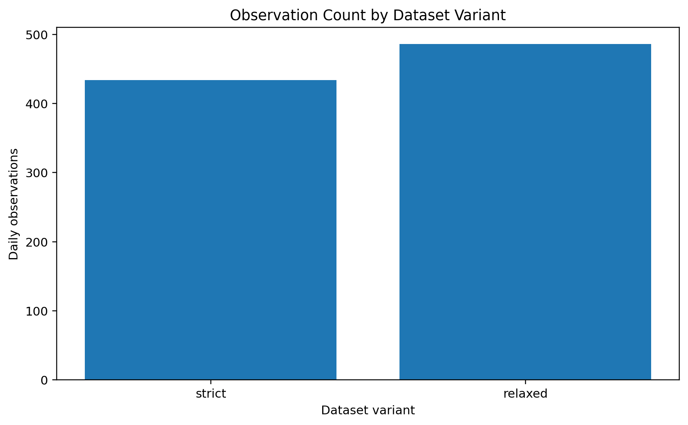

# Strict and Relaxed Modelling Datasets

**Executable:** `notebooks/05_dataset_Splitting.ipynb`
**Status:** I use this in the main dissertation workflow.

## Purpose

I made two versions of the dataset here. One is stricter on session quality, while the other keeps a few more days so I can see whether the conclusions depend on that choice.

## Workflow

## Inputs

- Aligned minute data
- Daily modelling data
- Session-quality audit

## Processing and rationale

- I apply the strict and relaxed session rules separately.
- I take the date boundaries from the strict sample, then use those same dates for both versions so the comparison stays fair.
- Before saving anything, I recheck the feature timing, targets and missing values.

## Outputs

- `data/derived/daily_underlying_model_dataset_strict_split.parquet`
- `data/derived/daily_underlying_model_dataset_relaxed_split.parquet`
- `outputs/dataset_variants/`

## Representative outputs

*This plot shows the sample-size trade-off created by the two data-quality definitions.*

The complete rules are recorded in the [dataset-variant manifest](../../outputs/dataset_variants/dataset_variant_manifest.json).

## Findings and decisions

- The strict dataset has 434 sessions and the relaxed one has 486.
- Both versions passed the missing-value, infinite-value and look-ahead checks.
- I carry both versions into modelling and only choose between them using the development period.

## Limitations

- The relaxed version gives me more rows, but it also accepts small gaps in VIX. That is the trade-off.
- Having two versions doesn't remove the need for time-aware validation.

## Next steps

- I can now run the same baseline models on both versions and compare them properly.
