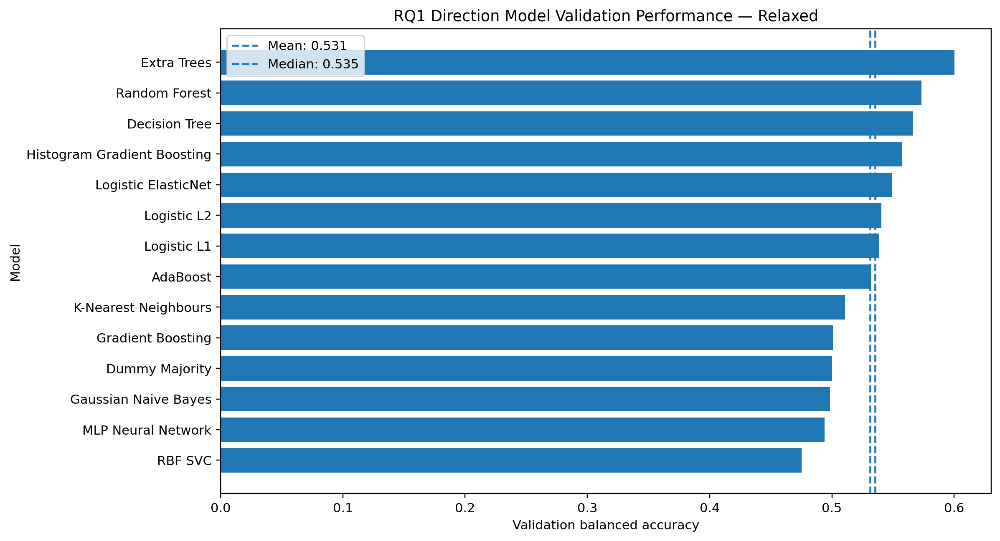
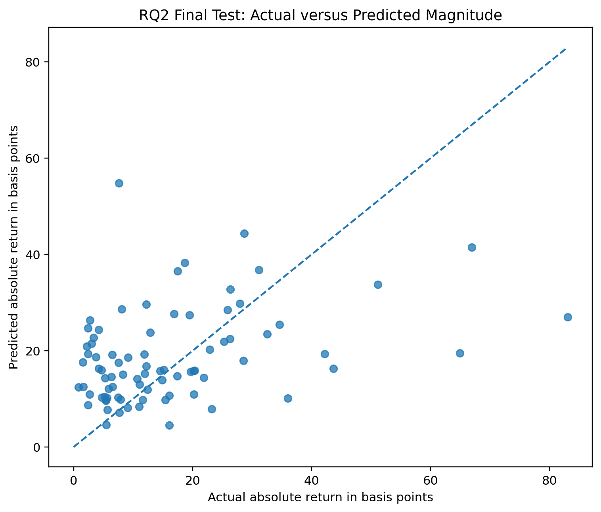
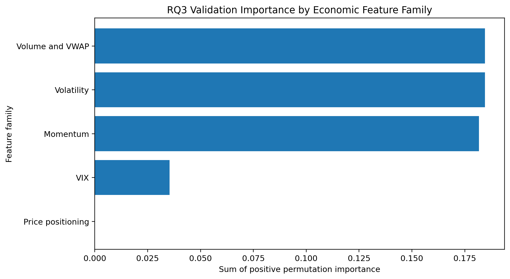

# 06 - Baseline Models for RQ1, RQ2 and RQ3

**File:** [notebooks/06_modeling_baseline.ipynb](../../notebooks/06_modeling_baseline.ipynb)

**How I use it:** This is the benchmark stage. I use it to find out whether machine learning adds anything beyond simple rules.

## The short version

Before doing any serious tuning, I compare ordinary models with dummy predictions, persistence, momentum and mean reversion. That gives each research question a sensible reference point. A model result only matters if it improves on something I could have produced without all the extra machinery.

## Where it sits in the workflow

This notebook contains the first model comparisons, but it is not where I make strong final claims. It is mainly for baselines, sanity checks and narrowing the search.

## What it needs

- Strict and relaxed chronological split Parquet files.
- The full and reduced feature lists.
- RQ1 direction, RQ2 absolute magnitude in basis points and RQ3 large-move targets.
- Time-aware validation rather than random train/test shuffling.

## What I actually do here

I treat each RQ differently because accuracy is not the right metric for everything.

- RQ1 compares classifiers with majority, persistence, momentum and mean-reversion direction rules using balanced accuracy as the main score.
- RQ2 compares regressors with simple magnitude benchmarks using MAE and related regression measures.
- RQ3 is imbalanced, so I focus on average precision, recall, F1 and balanced accuracy rather than raw accuracy alone.
- The same candidate families run on strict/relaxed and full/reduced combinations.
- I use validation to identify a shortlist, then look at the locked test block once as a baseline-stage check.
- Permutation importance and feature groups are saved for RQ3 so its feature question is not reduced to one classification score.

Seeing the simple rules next to the ML models kept me from treating a small score improvement as automatically meaningful.

## What it creates

- Model-comparison tables and figures under `outputs/baseline_models/`.
- Provisional validation winners and final locked-test results.
- RQ3 feature and feature-group importance tables.
- `validation_research_question_summary.json` with the baseline conclusions.

## Outputs worth opening

*This shows how close the ML models are to the simple direction rules rather than showing the winner alone.*

*This makes the usual shrinkage toward ordinary-sized moves much easier to see than MAE by itself.*

*This is the first direct answer to the RQ3 feature question, although the later fold-stability analysis is stronger.*

The numbers behind the figures are in [final locked test results](../../outputs/baseline_models/tables/final_locked_test_results.csv), [RQ1 rule baselines](../../outputs/baseline_models/tables/rq1_rule_baselines_validation.csv) and [RQ3 permutation importance](../../outputs/baseline_models/tables/rq3_validation_permutation_importance.csv).

## What I took from it

- Relaxed Extra Trees reached about 0.600 validation balanced accuracy for RQ1, only just above the 0.595 mean-reversion rule.
- Relaxed Elastic Net improved RQ2 validation MAE by roughly 1.32 bps over the dummy benchmark.
- The early RQ3 model beat prevalence on average precision, while its importance results pointed more toward volatility/volume information than a simple directional story.
- The baseline scores were useful but not strong enough to justify a large unrestricted tuning search.

## Things I wouldn't overclaim

- Validation and test blocks are small, so close model rankings can swap in another period.
- The baseline test results had been viewed before final tuning; they are evidence, but not untouched evidence.
- Feature importance explains the fitted model's reliance, not a causal market mechanism.

## What I run next

I take a limited model shortlist into [07 - nested hyperparameter tuning](07_hyperparameters_tuning.md), keeping the previously viewed Test block out of the search.
