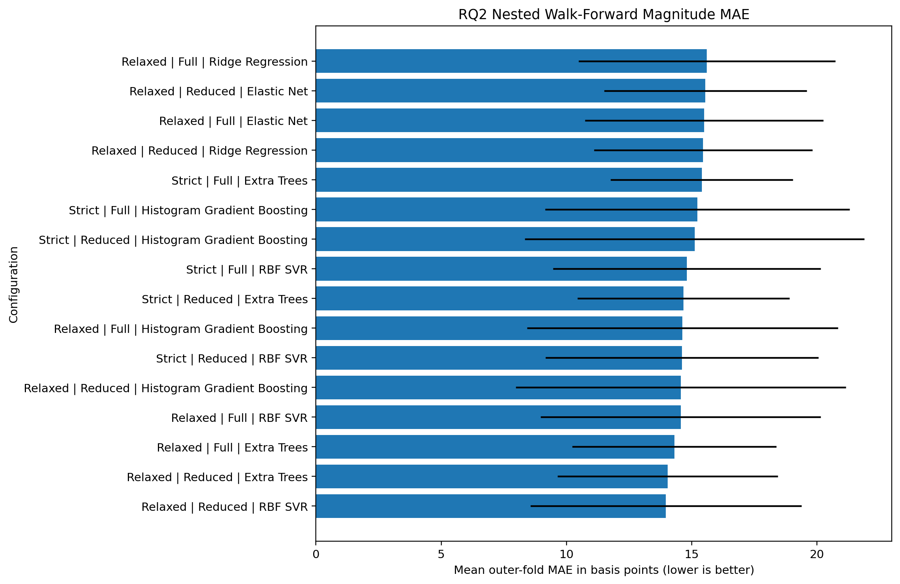

# 07 - Tuning the RQ1-RQ3 Models Without Using the Test Period

**File:** [notebooks/07_hyperparameters_tuning.ipynb](../../notebooks/07_hyperparameters_tuning.ipynb)

**How I use it:** This is the main model-selection notebook for the original dataset.

## The short version

This is where I tune the shortlisted models, but the bigger point is how I tune them. Every search uses chronological inner and outer folds, so the model is always trained on earlier rows and judged on later ones. I also choose the RQ1 and RQ3 probability cut-offs inside development rather than using 0.5 because it is convenient. The already-viewed Test block stays switched off.

## Where it sits in the workflow

The outer folds estimate how the whole selection process behaves. The inner folds are where parameters and thresholds are chosen. Mixing those jobs would make the reported score too optimistic.

## What it needs

- Strict and relaxed split datasets from notebook 05.
- Full and reduced feature sets.
- The limited model families carried forward from the baseline stage.
- Frozen scoring choices for direction, magnitude and large-move classification.

## What I actually do here

This notebook takes a while, so I keep the search space controlled and save the fold-level evidence rather than only printing a winner.

- For every outer fold, I run a smaller chronological search inside the available training history.
- RQ1 is selected mainly with balanced accuracy, RQ2 with magnitude error, and RQ3 with average precision because large moves are uncommon.
- The RQ1 and RQ3 classification thresholds are derived from development predictions rather than the Test rows.
- I compare strict/relaxed and full/reduced versions as part of the same development process.
- The winning specifications, parameters and thresholds are written to a manifest so later notebooks do not quietly reselect them.
- When model saving is enabled, the final development estimator is fitted on Train + Validation only and saved under `models/classical/`.

I keep the Test switch off here because looking at it again during tuning would not make it fresh. The later post-freeze notebook is the genuinely newer check.

## What it creates

- Nested summary and outer-fold tables under `outputs/hyperparameter_tuning/tables/`.
- Fold-comparison figures under `outputs/hyperparameter_tuning/figures/`.
- `final_tuned_configuration_manifest.json`.
- A short generated results draft and, when enabled, canonical model artifacts.

## Outputs worth opening

*I use this to see whether RQ1 is consistently useful or just carried by one fold.*

*This shows the magnitude errors across later chronological blocks, which answers RQ2 more honestly than one average.*

*Average precision matters here because ordinary days are much more common than large-move days.*

The exact results are in [nested tuned winners](../../outputs/hyperparameter_tuning/tables/nested_tuned_winners.csv), the three [RQ1](../../outputs/hyperparameter_tuning/tables/rq1_nested_tuning_outer_folds.csv), [RQ2](../../outputs/hyperparameter_tuning/tables/rq2_nested_tuning_outer_folds.csv) and [RQ3](../../outputs/hyperparameter_tuning/tables/rq3_nested_tuning_outer_folds.csv) fold files, and the [final configuration manifest](../../outputs/hyperparameter_tuning/final_tuned_configuration_manifest.json).

## What I took from it

- The selected original-data models were relaxed Histogram Gradient Boosting for RQ1, relaxed RBF SVR for RQ2 and strict full-feature RBF SVC for RQ3.
- RQ1 averaged roughly 0.544 outer-fold balanced accuracy, which is weak rather than a strong directional edge.
- RQ2 produced usable ordinary-session errors but still tended to shrink large movements toward the middle.
- RQ3's average-precision framing was more informative than headline accuracy because the positive class was uncommon.

## Things I wouldn't overclaim

- Three outer and three inner folds are not many, but more splits would leave very little data inside each search.
- Nested validation reduces selection bias; it cannot manufacture a larger or more stable market sample.
- The chosen winner is still a development decision and needs separate robustness and later-period checks.

## What I run next

I keep these configurations fixed and move to [08 - robustness checks](08_hyperparameters_tuning_extended_robustness.md), where I compare matched benchmarks, feature stability, regimes and selective coverage.
