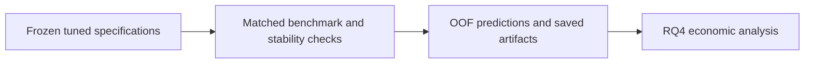
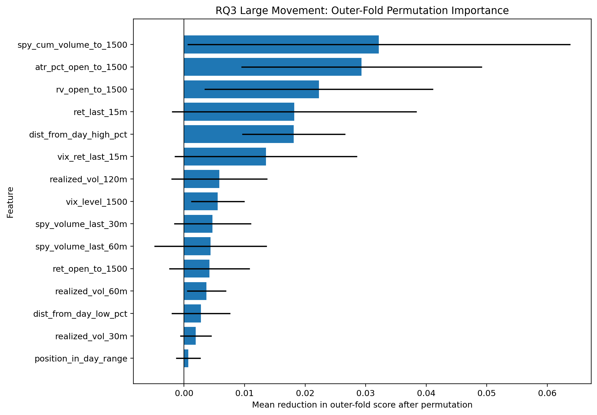

# 08 - Extended Robustness Checks and Model Persistence

**File:** [notebooks/08_hyperparameters_tuning_extended_robustness.ipynb](../../notebooks/08_hyperparameters_tuning_extended_robustness.ipynb)

**Role in the project:** This is the follow-up to tuning. It asks whether the selected results still make sense when I look beyond the average score.

## Overview

Winning a tuning table is not enough for me to trust a model. Here I rebuild each selected specification inside the same chronological folds as its benchmark, check which features matter in more than one fold, split the predictions into market regimes, and look at what happens when RQ1 only acts on its most confident cases. This notebook also contains the canonical model-saving step.

## Workflow

These checks still use development data, but they make the weaknesses much more visible before the signals are carried into the economic and option stages.

## Inputs

- Strict and relaxed chronological datasets.
- The selected model families, feature sets, parameters and thresholds from notebook 07.
- Time-aware outer folds used for like-for-like benchmark comparisons.
- `scripts/model_artifacts.py` when canonical saving is enabled.

## Processing

The checks focus on whether the reported result remains credible under matched benchmarks, alternative specifications and changing market regimes.

- I rerun the chosen model inside every outer fold and save the prediction for each held-out development session.
- Simple benchmarks are evaluated on those exact same dates rather than on a friendlier sample.
- Permutation importance is repeated by fold, then summarised by feature and feature group.
- Regime cut-offs are calculated from earlier training data only.
- RQ1 predictions are sorted by confidence to show the coverage and accuracy trade-off when lower-confidence sessions are excluded.
- The final Train + Validation pipelines can be atomically saved, hashed and reloaded without including Test or future holdout rows.

The out-of-fold prediction file produced here becomes the join point for RQ4. Session-level rows are therefore retained alongside the summary averages.

## Outputs

- `selected_winner_outer_fold_predictions.csv` with session-level RQ1-RQ3 development predictions.
- Fold-matched benchmark, regime and confidence tables.
- Feature and feature-group stability tables and figures.
- Canonical model files and `models/classical/manifest.json` when saving is enabled.

## Key outputs and figures

*This is the practical trade-off: accuracy may improve when I act less often, but the sample becomes much smaller.*

*This is more useful for RQ3 than one feature ranking because I can see whether the contribution survives different time blocks.*

The [fold-matched benchmark summary](../../outputs/hyperparameter_tuning/tables/fold_matched_benchmark_summary.csv) shows whether ML actually beat simple alternatives on the same rows. [Feature importance stability](../../outputs/hyperparameter_tuning/tables/feature_importance_stability.csv) and [feature-group stability](../../outputs/hyperparameter_tuning/tables/feature_group_importance_stability.csv) are the main tables for interpreting RQ3. The [outer-fold predictions](../../outputs/hyperparameter_tuning/tables/selected_winner_outer_fold_predictions.csv) feed RQ4 directly.

## Findings and decisions

- RQ1 sometimes improved when coverage was reduced, but the improvement was not smooth or completely stable.
- For the final original-data RQ3 model, cumulative SPY volume had the highest mean importance, while percentage ATR was the most consistently important feature across all folds.
- True range and realised volatility were the most dependable feature groups once I looked beyond a single fold.
- The regime results moved around enough that I kept regime claims descriptive rather than turning them into another tuned strategy.

## Limitations and considerations

- This is post-selection analysis on development predictions, not an independent confirmation.
- Confidence and regime subgroups can become tiny very quickly.
- Permutation importance describes the fitted prediction function and can spread importance across correlated features.

## Next stage

The saved out-of-fold predictions go to [12 - RQ4 economic usefulness](12_rq4_economic_meaningfulness.md). The model artifacts stay frozen for the later [fresh holdout](18_fresh_holdout_end_to_end_evaluation.md).
