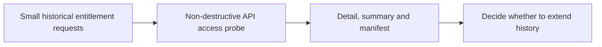

# Massive 2021-2022 Access Probe

**Executable:** `notebooks/09_probe_massive_2021_2022_underlying_access.ipynb`
**Status:** I use this in the main dissertation workflow.

## Purpose

Before trying to download whole years, I use this notebook to check a handful of 2021 and 2022 dates for SPY, SPX and VIX. It is only an access test and doesn't change the project database.

## Workflow

## Inputs

- `main.env` with `MASSIVE_API_KEY`
- Pre-selected dates in 2021, 2022 and the 2023 control year

## Processing and rationale

- I request a few normal weekdays for each ticker and year.
- I label each result as available, empty or an error/entitlement problem.
- I save the evidence separately and leave the main raw folders alone.

## Outputs

- `outputs/underlying_history_probe/massive_2021_2022_probe_detail.csv`
- Probe summary CSV and JSON manifest

## Representative outputs

The entitlement result is preserved in the [probe manifest](../../outputs/underlying_history_probe/massive_2021_2022_probe_manifest.json) and [probe summary](../../outputs/underlying_history_probe/massive_2021_2022_probe_summary.csv).

## Findings and decisions

- The manifest shows exactly what the account returned without changing any research dataset.
- I test more than one date because one odd market day isn't enough to judge a whole year.

## Limitations

- A few successful dates don't guarantee complete coverage for the year.
- The result can also change later if the account entitlements change.

## Next steps

- I would only expand the history if all three series show usable access.
