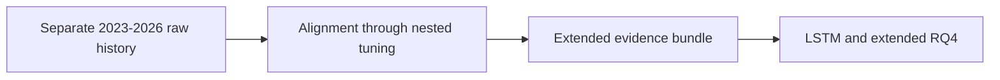

# 10 - Repeating the Full Pipeline on the 2023-2026 Extension

**File:** [notebooks/10_extended_2023_2026_full_pipeline.ipynb](../../notebooks/10_extended_2023_2026_full_pipeline.ipynb)

**How I use it:** This is a large sensitivity run kept separate from the original pipeline and outputs.

## The short version

This notebook repeats almost everything from retrieval through tuning on a longer 2023-2026 underlying history. I kept its data, database and outputs isolated so it could not overwrite the original study. It is long and not especially elegant, but it answers an important question: do the model and feature conclusions change when I give them a different history?

## Where it sits in the workflow

I use this as a robustness extension, not as a reason to erase the original result when the preferred model changes.

## What it needs

- Massive access through `main.env`.
- The isolated `data_extended_2023_2026/` root and its own database.
- The same ticker, session, feature and target definitions as the maintained pipeline.
- Shared functions from `scripts/massive_database.py`.

## What I actually do here

The notebook is essentially a replay of notebooks 02-08 inside one isolated file.

- I download the additional minute history into the extension folder.
- SPY again acts as the clock and SPX/VIX are matched backwards using the same two-minute tolerance.
- The same daily features, session-quality rules and chronological split logic are rebuilt rather than copied from the original data.
- Baseline models, nested searches, thresholds, benchmarks and permutation importance are rerun on the longer history.
- All outputs are written below `outputs/extended_2023_2026/` so original evidence remains unchanged.

A different winner here is useful evidence of period sensitivity. It is not automatically a mistake in either pipeline.

## What it creates

- The isolated `data_extended_2023_2026/` data tree.
- Extended EDA, cleaning, dataset, baseline and tuning folders.
- A separate extended model-evidence bundle under `outputs/extended_2023_2026/`.
- Inputs used later by the LSTM and extended RQ4 notebooks.

## Outputs worth opening

*This lets me compare the shape of the longer period with the original sample before comparing models.*

*The fold movement matters more to me than the single average winner.*

*The longer run again puts true-range and realised-volatility information near the top, which is one of the more stable RQ3 conclusions.*

The model choices are in [extended tuned winners](../../outputs/extended_2023_2026/hyperparameter_tuning/tables/nested_tuned_winners.csv), with feature evidence in the [extended importance stability table](../../outputs/extended_2023_2026/hyperparameter_tuning/tables/feature_importance_stability.csv).

## What I took from it

- The longer run selected strict Extra Trees for RQ1, relaxed RBF SVR for RQ2 and a strict reduced-feature RBF SVC for RQ3.
- RQ1 changing from the original winner showed that directional modelling was sensitive to the period.
- RQ2 retained the same broad RBF SVR family, while RQ3 again relied most consistently on true range and realised volatility.
- The extension is useful corroboration and sensitivity evidence, but it remains development data.

## Things I wouldn't overclaim

- It is a very large notebook and slower to inspect than the split main pipeline.
- Repeating selection on a longer dataset does not create an independent holdout.
- The extension can still inherit provider gaps and the same feature limitations as the original data.

## What I run next

I use the aligned extended minute sequences in [11 - the LSTM experiment](11_lstm_intraday_sequence_extension.md) and the extended out-of-fold predictions in [13 - extended RQ4](13_rq4_economic_meaningfulness_extended.md).
