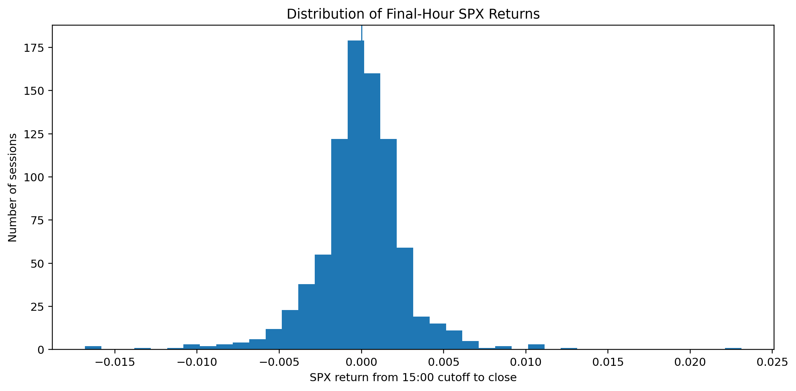
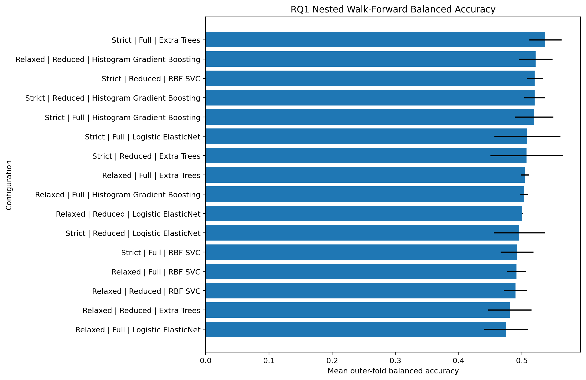
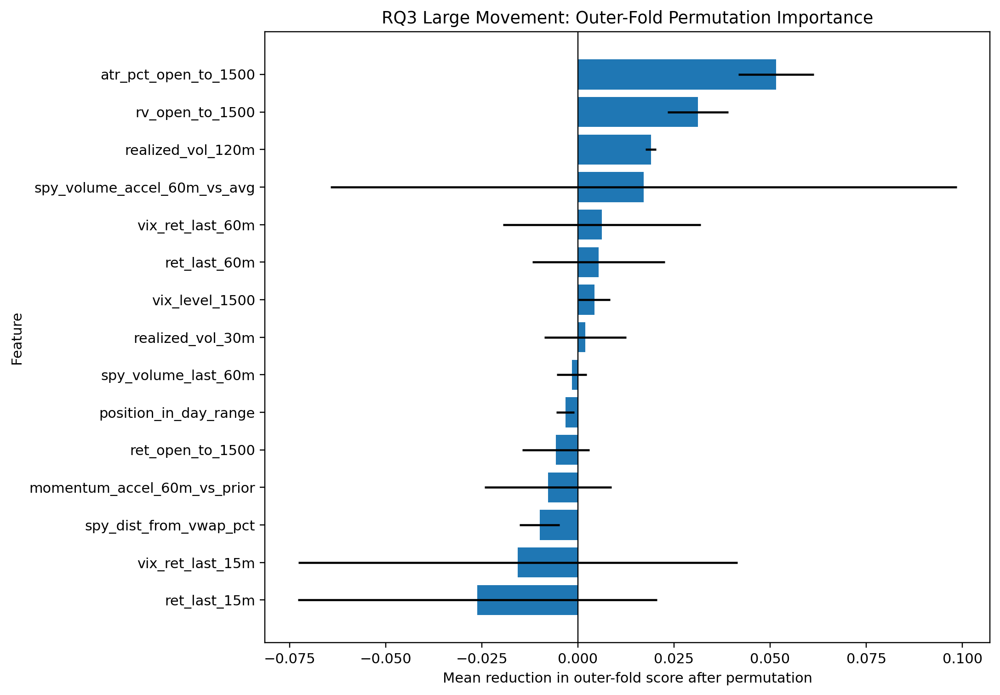

# 10 - Extended 2023-2026 Modelling Pipeline

**File:** [notebooks/10_extended_2023_2026_full_pipeline.ipynb](../../notebooks/10_extended_2023_2026_full_pipeline.ipynb)

**Role in the project:** This is a sensitivity run kept separate from the original pipeline and outputs.

## Overview

This notebook repeats the workflow from retrieval through tuning using a longer 2023-2026 underlying history. Its data, database and outputs remain isolated so the original study is not overwritten. Its purpose is to assess whether the model choices, performance and feature conclusions change when the historical period is extended.

## Workflow

This is treated as a robustness extension. A change in the preferred model is reported as period sensitivity rather than used to replace the original result.

## Inputs

- Massive access through `main.env`.
- The isolated `data_extended_2023_2026/` root and its own database.
- The same ticker, session, feature and target definitions as the maintained pipeline.
- Shared functions from `scripts/massive_database.py`.

## Processing

The notebook is essentially a replay of notebooks 02-08 inside one isolated file.

- I download the additional minute history into the extension folder.
- SPY again acts as the clock and SPX/VIX are matched backwards using the same two-minute tolerance.
- The same daily features, session-quality rules and chronological split logic are rebuilt rather than copied from the original data.
- Baseline models, nested searches, thresholds, benchmarks and permutation importance are rerun on the longer history.
- All outputs are written below `outputs/extended_2023_2026/` so original evidence remains unchanged.

A different winner here is useful evidence of period sensitivity. It is not automatically a mistake in either pipeline.

## Outputs

- The isolated `data_extended_2023_2026/` data tree.
- Extended EDA, cleaning, dataset, baseline and tuning folders.
- A separate extended model-evidence bundle under `outputs/extended_2023_2026/`.
- Inputs used later by the LSTM and extended RQ4 notebooks.

## Key outputs and figures

*This supports a comparison of the target distribution in the extended and original samples before model performance is considered.*

*The variation across folds provides important context for the average performance and selected model.*

*The longer run again puts true-range and realised-volatility information near the top, which is one of the more stable RQ3 conclusions.*

The model choices are in [extended tuned winners](../../outputs/extended_2023_2026/hyperparameter_tuning/tables/nested_tuned_winners.csv), with feature evidence in the [extended importance stability table](../../outputs/extended_2023_2026/hyperparameter_tuning/tables/feature_importance_stability.csv).

## Findings and decisions

- The longer run selected strict Extra Trees for RQ1, relaxed RBF SVR for RQ2 and a strict reduced-feature RBF SVC for RQ3.
- RQ1 changing from the original winner showed that directional modelling was sensitive to the period.
- RQ2 retained the same broad RBF SVR family, while RQ3 again relied most consistently on true range and realised volatility.
- The extension is useful corroboration and sensitivity evidence, but it remains development data.

## Limitations and considerations

- Model selection is repeated within the extended period, so these results provide sensitivity evidence rather than an independent holdout validation.
- Changes between the original and extended results can reflect both the additional observations and a different mix of market regimes.
- The extension uses the same provider and feature definitions, so the original data-coverage and feature limitations still apply.

## Next stage

The aligned extended minute sequences are used in [11 - the LSTM experiment](11_lstm_intraday_sequence_extension.md), while the extended out-of-fold predictions are used in [13 - extended RQ4](13_rq4_economic_meaningfulness_extended.md).
