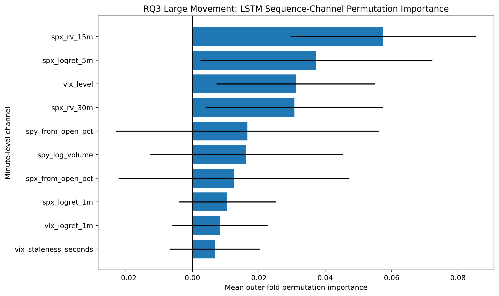

# 11 - Trying an LSTM on the Actual Intraday Sequence

**File:** [notebooks/11_lstm_intraday_sequence_extension.ipynb](../../notebooks/11_lstm_intraday_sequence_extension.ipynb)

**How I use it:** This is an exploratory extension. I do not treat it as the automatic replacement for the classical models.

## The short version

The classical models get one engineered row per day. This notebook asks whether the actual 13:00-14:59 path contains useful timing information that those summaries miss. Each usable session becomes a 120-minute sequence. The network is deliberately small because the number of daily examples is still tiny by deep-learning standards.

## Where it sits in the workflow

This is a model-family sensitivity check. A complicated network does not get extra credit just for being complicated.

## What it needs

- Extended aligned one-minute SPY, SPX and VIX data.
- The extended strict daily target/split file.
- Sixteen sequence channels covering returns, volatility, volume, level, position, staleness and time.
- Classical outer-fold results for an overlap comparison.

## What I actually do here

I keep the sequence definition fixed at 13:00-14:59 so every input is available before the final-hour target starts.

- I build exactly 120 ordered minutes for each complete strict session.
- Scalers are fitted inside each chronological training fold, never on later sequences.
- A latest-development block is used for early stopping and epoch selection.
- Small regularised LSTMs are evaluated for RQ1, RQ2 and RQ3 with the same task-appropriate metrics.
- Permutation checks shuffle one sequence channel at a time to see which inputs the network relies on.
- Optional development refits and scalers are saved under `models/lstm/` and clearly labelled exploratory.

I compare on overlapping dates because a higher score on a different set of sessions would not be a fair classical-versus-LSTM comparison.

## What it creates

- Fold histories, out-of-fold predictions and task summaries.
- Sequence-quality and overlap-comparison tables.
- LSTM importance and training figures.
- Exploratory `.keras` models, scalers and a manifest when saving is enabled.

## Outputs worth opening

*This is what one day looks like to the network. It helps explain the difference from the one-row classical models.*

*I check this for overfitting and unstable epoch choices rather than assuming more training is better.*

*This gives an exploratory view of which minute channels mattered for the LSTM large-move task.*

The main numerical files are the [research-question summary](../../outputs/extended_2023_2026/lstm_sequence_extension/tables/lstm_research_question_summary.csv), [classical overlap comparison](../../outputs/extended_2023_2026/lstm_sequence_extension/tables/lstm_vs_classical_oof_overlap.csv) and [sequence quality audit](../../outputs/extended_2023_2026/lstm_sequence_extension/tables/lstm_sequence_quality.csv).

## What I took from it

- The sequence approach did not produce a clear, stable reason to replace the simpler classical models.
- RQ1 remained difficult, and the fresh check later showed the LSTM's apparently better accuracy could come from predicting only the majority direction.
- RQ2 and RQ3 sequence channels gave useful exploratory importance patterns, but fold variation was large.
- Keeping the network small and reporting the comparison honestly was more useful than running a huge search.

## Things I wouldn't overclaim

- There are only hundreds of daily sequences, which is very small for deep learning.
- Neural results can move with random initialisation and training conditions.
- The sequence inputs still contain no option premiums, spreads or order-book information.
- The saved LSTM refits are exploratory development models, not independently established final models.

## What I run next

I keep the classical models as the main pipeline and use this notebook as supporting sensitivity evidence. Both model families are evaluated without refitting in [18 - the fresh holdout](18_fresh_holdout_end_to_end_evaluation.md).
