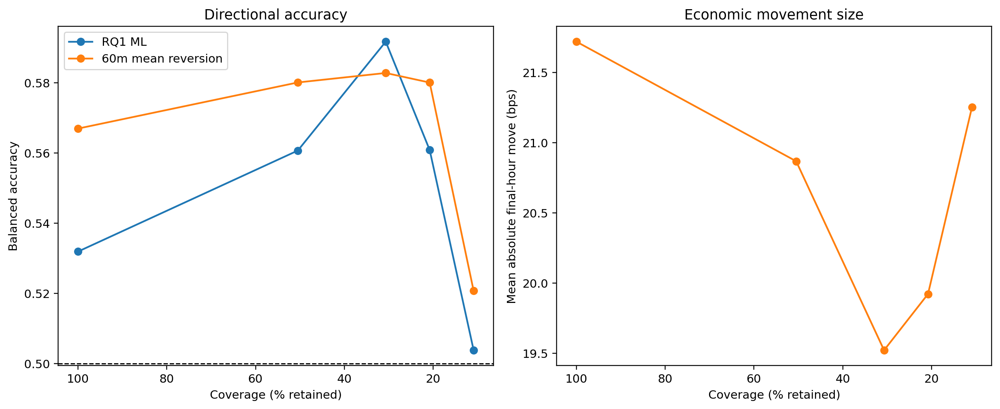
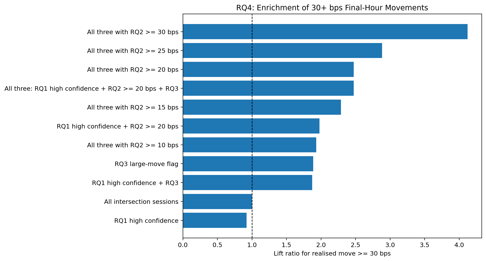
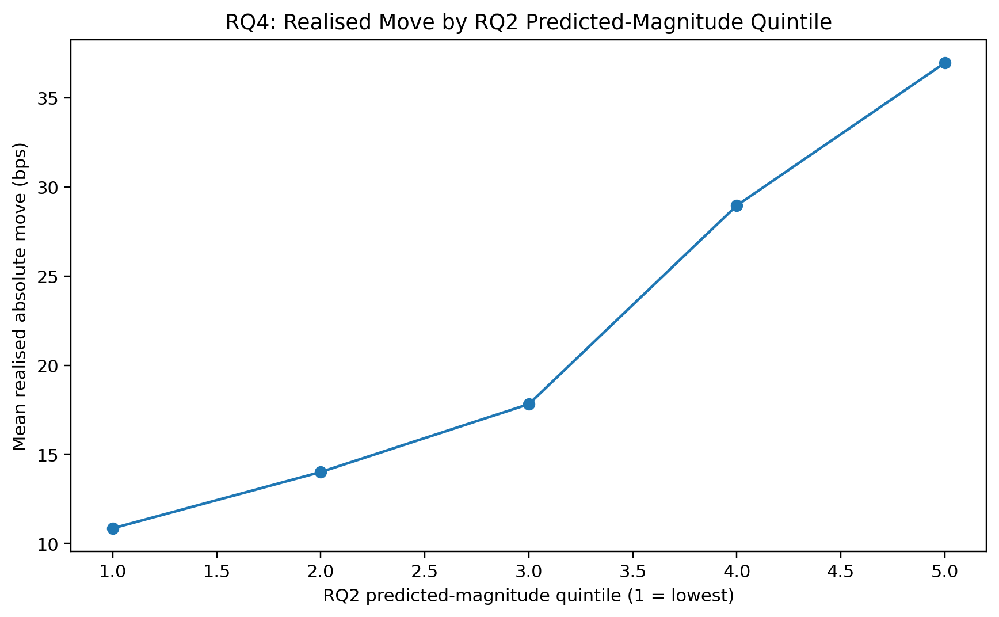

# 12 - Checking Whether the Model Signals Point to Useful SPX Moves

**File:** [notebooks/12_rq4_economic_meaningfulness.ipynb](../../notebooks/12_rq4_economic_meaningfulness.ipynb)

**How I use it:** This is the bridge between predictive scores and the eventual option strategy.

## The short version

A balanced-accuracy or MAE result does not tell me whether the model finds tradable-looking situations. Here I join the out-of-fold RQ1, RQ2 and RQ3 signals by date and ask whether confidence or combined filters concentrate bigger and more directionally predictable final-hour moves. No option P&L is used yet, which keeps the signal choice separate from the backtest outcome.

## Where it sits in the workflow

The point is economic meaning, not another round of unrestricted model selection. Rules carried into RQ5 are fixed before option outcomes are inspected.

## What it needs

- Selected-winner outer-fold predictions from notebook 08.
- Strict and relaxed daily source rows for realised movement and market context.
- Frozen RQ1 confidence, RQ2 magnitude and RQ3 large-move definitions.
- Moving-block bootstrap settings for uncertainty.

## What I actually do here

I look at the signals individually first, then combine them so I can see which part is doing the filtering.

- RQ1 accuracy is checked by confidence level and by realised move size.
- RQ2 predictions are grouped into magnitude bands and compared with what actually happened.
- RQ3 is used as the large-opportunity gate rather than judged by raw accuracy alone.
- Combined rules are tested for coverage, precision and lift at 20- and 30-bps opportunity thresholds.
- Regime tables and moving-block bootstraps show how uncertain the concentrated results are.
- The chosen RQ5 candidate dates are saved before option contracts or P&L are examined.

This lets me say whether the signals concentrate opportunities without pretending that concentration automatically equals profit.

## What it creates

- Joined RQ1-RQ3 prediction rows and combined-signal summaries.
- Confidence, magnitude-quintile, lift, regime and bootstrap tables.
- Four RQ4 figures and a generated dissertation draft.
- The candidate-session evidence used by RQ5.

## Outputs worth opening

*This is useful because it shows both sides of selective prediction: accuracy and how often the model is willing to act.*

*This shows whether the filters find a larger share of economically bigger moves than the base sample.*

*This is the clearer RQ2 check: do larger predictions line up with larger realised opportunities?*

The [combined signal summary](../../outputs/rq4_economic_meaningfulness/tables/rq4_combined_signal_summary.csv), [opportunity precision and lift](../../outputs/rq4_economic_meaningfulness/tables/rq4_opportunity_precision_and_lift.csv) and [bootstrap summary](../../outputs/rq4_economic_meaningfulness/tables/rq4_moving_block_bootstrap_summary.csv) contain the numbers behind the plots.

## What I took from it

- Overall RQ1 balanced accuracy was about 0.532, below the matched 60-minute mean-reversion result of about 0.567.
- At 30% coverage, RQ1 balanced accuracy improved to roughly 0.592 across 93 sessions, but those sessions did not also have a clearly larger mean realised move.
- The three-model rule produced a much smaller and more concentrated set of larger opportunities in development.
- That concentration was interesting enough to freeze for RQ5, but the bootstrap ranges warned against treating it as settled.

## Things I wouldn't overclaim

- The combined rule was examined on development out-of-fold predictions, not a future untouched period.
- Subgroup and high-confidence counts become small, so lift estimates can look dramatic.
- This stage ignores option premium, liquidity, spread, slippage, commission and intrahour path.

## What I run next

I keep the chosen opportunity rule fixed and move to [14 - option-data retrieval](14_rq5_options_data_retrieval.md). The longer-history version is checked separately in [13](13_rq4_economic_meaningfulness_extended.md).
