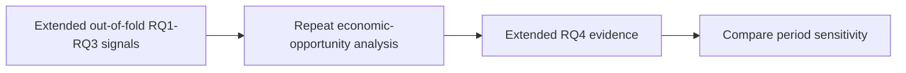

# Extended-History RQ4 Economic Meaningfulness

**Executable:** `notebooks/13_rq4_economic_meaningfulness_extended.ipynb`
**Status:** I use this in the main dissertation workflow.

## Purpose

I repeat the RQ4 checks on the longer, separate dataset here. The idea is to see whether the same opportunity story still appears when the history changes.

## Workflow

## Inputs

- Extended selected-winner predictions
- Extended strict and relaxed datasets
- Extended tuning outputs

## Processing and rationale

- I reuse the same confidence, magnitude and large-move checks from the main RQ4 notebook.
- I compare lift, regimes and uncertainty without changing the original results.

## Outputs

- `outputs/extended_2023_2026/rq4_economic_meaningfulness/`

## Representative outputs

*This plot shows the same confidence-versus-opportunity relationship on the extended history.*

*This plot shows the extended-period lift for moves of at least 30 basis points.*

## Findings and decisions

- This gives me a sensitivity check using more history but the same interpretation rules.
- I keep it separate from the original result and from any genuinely untouched future holdout.

## Limitations

- The extended sample was also used during development and model selection.
- It still doesn't answer whether the signals make money at option level.

## Next steps

- I compare the two RQ4 runs, then only carry pre-specified signals into RQ5.
