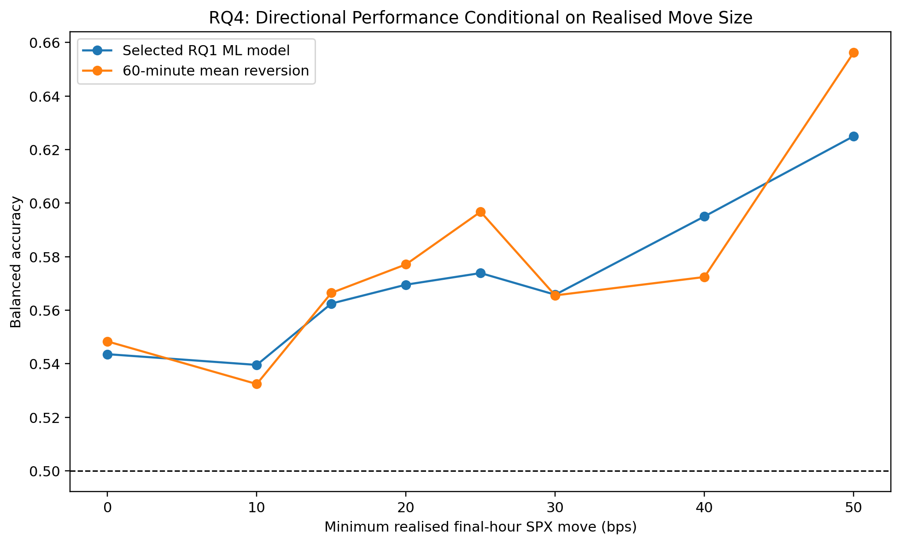

# 13 - Extended RQ4 Economic Meaningfulness

**File:** [notebooks/13_rq4_economic_meaningfulness_extended.ipynb](../../notebooks/13_rq4_economic_meaningfulness_extended.ipynb)

**Role in the project:** This is a period-sensitivity check. It does not replace the original RQ4 evidence.

## Overview

This notebook takes the out-of-fold predictions from the separate 2023-2026 run and repeats the confidence, magnitude and opportunity-lift checks used in notebook 12. Its purpose is to assess whether the broad findings remain consistent across a different history, without selecting a new rule from the extended results.

## Workflow

Keeping the folder and results separate makes disagreement useful. If the extended pattern changes, I can discuss period sensitivity instead of overwriting the original result.

## Inputs

- Extended selected-winner outer-fold predictions.
- Extended strict and relaxed daily rows.
- The same opportunity thresholds and interpretation rules used in notebook 12.
- Extended tuning manifests and fold summaries.

## Processing

I reuse the analysis structure rather than redesigning it around what the longer sample happens to show.

- RQ1 confidence and direction accuracy are compared across coverage levels.
- RQ2 prediction bands are checked against realised move size.
- RQ3 and the combined filters are evaluated for opportunity precision and lift.
- Regime and moving-block bootstrap summaries are recreated on the extended rows.
- All evidence is written below the extended output root.

The useful question is whether the direction of the conclusion is similar, not whether every number matches.

## Outputs

- Extended joined prediction rows and combined-signal summaries.
- Extended confidence, magnitude, regime, lift and bootstrap tables.
- Four figures below `outputs/extended_2023_2026/rq4_economic_meaningfulness/`.
- A separate generated draft for comparison with the original RQ4 run.

## Key outputs and figures

*I compare this directly with the original plot rather than reading it on its own.*

*This shows whether the longer-period filters still concentrate larger moves.*

*This helps separate general direction skill from performance on economically larger days.*

The exact comparison material is in the [extended combined signal summary](../../outputs/extended_2023_2026/rq4_economic_meaningfulness/tables/rq4_combined_signal_summary.csv), [opportunity lift table](../../outputs/extended_2023_2026/rq4_economic_meaningfulness/tables/rq4_opportunity_precision_and_lift.csv) and [bootstrap summary](../../outputs/extended_2023_2026/rq4_economic_meaningfulness/tables/rq4_moving_block_bootstrap_summary.csv).

## Findings and decisions

- The longer history gives a useful sensitivity check, but it does not turn the original development rule into independent evidence.
- Direction, confidence and opportunity relationships changed with the modelling period, which matches the instability already seen in RQ1.
- The combined filtering idea remained worth investigating, while the exact size of the lift was period-dependent.
- Both sets of results are retained so the discussion can show areas of agreement and period sensitivity.

## Limitations and considerations

- The extension was also used for model selection.
- It shares the same target construction and many of the same provider limitations as the original pipeline.
- There are still no option prices in this notebook, so economic opportunity is not the same as realised trade performance.

## Next stage

I compare the original and extended RQ4 results in the discussion, but RQ5 contract selection follows the frozen original workflow documented in [14](14_rq5_options_data_retrieval.md).
