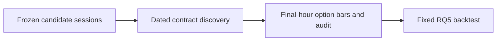

# 14 - RQ5 Options Data Retrieval

**File:** [notebooks/14_rq5_options_data_retrieval.ipynb](../../notebooks/14_rq5_options_data_retrieval.ipynb)

**Role in the project:** This collects the option evidence after the candidate dates and filters have already been frozen.

## Overview

This notebook covers the data-engineering stage of RQ5. I start with the dates selected by the underlying models, discover the same-day SPX contracts that existed on each date, choose ATM and fixed OTM alternatives, and download only the final-hour bars needed by the strategy. The order matters: I do not look at which option made money and then decide that was the contract I meant to trade.

## Workflow

Contract selection is based on SPX at the decision time and pre-set offsets. Outcome prices are not part of the selection rule.

## Inputs

- RQ4 combined out-of-fold predictions and frozen candidate dates.
- Massive API access through `main.env`.
- ATM plus 5, 10, 15, 20, 25 and 30-point OTM offsets.
- The planned 15:00-15:05 entry and 15:55-15:59 exit windows.

## Processing

A substantial part of RQ5 involves documenting which option data was available before calculating P&L.

- For each selected date I query SPX/SPXW contracts with the exact same-day expiry.
- Calls and puts are chosen deterministically by distance to the pre-set target strike, with a stable tie-break.
- Minute aggregates are downloaded for roughly 14:55-16:00 so the entry, path and exit can be checked.
- I audit whether bars exist in both planned execution windows and record contracts with no returned history.
- The final contract map and raw bars are frozen before notebook 15 calculates strategy outcomes.

This prevents the backtest from reselecting a more favourable strike or option side after observing the result.

## Outputs

- `raw/rq5_option_minute_bars.parquet` and a CSV copy.
- Candidate-session, contract-selection and contract-discovery tables.
- Option-bar download and data-quality logs.
- `rq5_retrieval_manifest.json` with the fixed scope and provider caveats.

## Key outputs and figures

The [candidate-session table](../../outputs/rq5_options_trading/tables/rq5_primary_candidate_sessions.csv) shows why each date reached RQ5. The [contract map](../../outputs/rq5_options_trading/tables/rq5_contract_selection.csv) links those dates to the exact calls and puts, while the [download log](../../outputs/rq5_options_trading/tables/rq5_option_bar_download_log.csv) and [quality table](../../outputs/rq5_options_trading/tables/rq5_option_data_quality.csv) show what was actually usable.

The minute-level evidence is in [Parquet](../../outputs/rq5_options_trading/raw/rq5_option_minute_bars.parquet), and the [retrieval manifest](../../outputs/rq5_options_trading/rq5_retrieval_manifest.json) is the quickest place to check the frozen assumptions. These tables are more appropriate than a retrieval chart because they show the exact ticker and date.

## Findings and decisions

- The saved run collected 15,279 option-minute rows.
- Seventeen calls and seventeen puts were usable at every strike offset tested; three earlier contracts on each side had no bars.
- The SPXW contract symbols could still be found using the SPX reference-underlying query.
- Saving the failed and empty requests made the final 17-trade sample fully traceable.

## Limitations and considerations

- The minute aggregates are trade-derived and do not reproduce historical bid/ask quotes or queue position.
- Older contracts can fall outside the provider's rolling option-history window.
- A missing bar can mean no recorded trade, unavailable history or an entitlement issue; it is not safe to assume a zero price.

## Next stage

The frozen contract map and minute bars feed [15 - the options backtest](15_rq5_options_backtest.md). I do not rerun selection inside the backtest.
