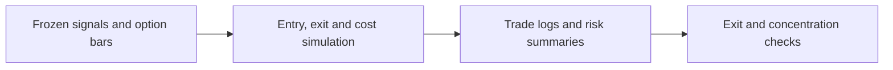
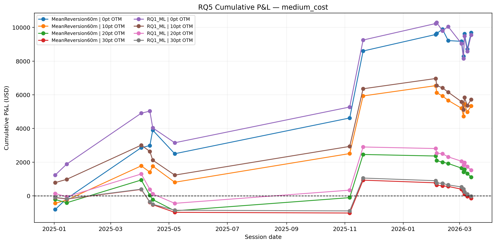
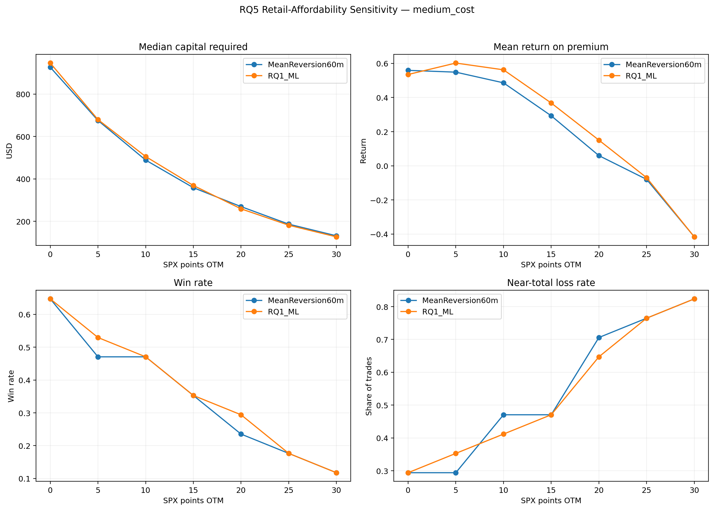
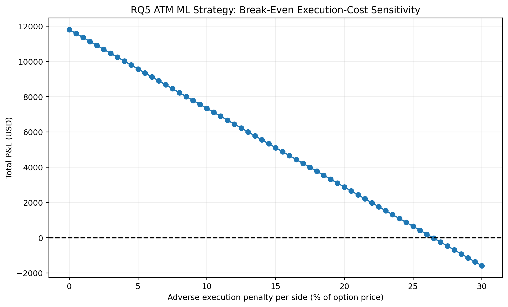

# 15 - Running the Frozen 0DTE SPX Options Backtest

**File:** [notebooks/15_rq5_options_backtest.ipynb](../../notebooks/15_rq5_options_backtest.ipynb)

**How I use it:** This is the main RQ5 backtest and the first point where the frozen signals are translated into option P&L.

## The short version

Here I take the fixed candidate dates, direction signals and contract map and turn them into one-hour option trades. I use the first usable opening price from 15:00-15:05 and the last usable close from 15:55-15:59, then make those reference prices less generous under several synthetic cost assumptions. The notebook also compares ML with the 60-minute mean-reversion direction on the same dates.

## Where it sits in the workflow

RQ5 is a strategy question, so I report dollars, return on premium, drawdown and risk-adjusted summaries rather than presenting classifier accuracy as trading performance.

## What it needs

- Frozen candidate dates and contract selections from notebook 14.
- Saved option-minute bars.
- RQ1 ML direction and the matched 60-minute mean-reversion direction.
- ATM as the primary strike plus OTM sensitivity offsets.
- Frictionless, low, medium and severe synthetic execution-cost assumptions.

## What I actually do here

The rules are intentionally simple enough that I can trace every trade back to a date, contract and bar.

- I choose calls for an up signal and puts for a down signal without using option outcomes.
- Every strategy uses the same entry and exit window definitions.
- Entry prices are increased and exit prices reduced by the chosen cost penalty, with commissions deducted separately.
- ML and mean reversion are paired on the same candidate dates and strikes.
- I summarise P&L, return on premium, win rate, profit factor, drawdown, near-total losses and non-annualised per-trade Sharpe/Sortino-style ratios.
- Affordability, OTM distance, RQ2 threshold, transaction-cost and bootstrap sensitivity tables are saved rather than hiding behind the main ATM row.

The primary result is ATM with medium costs. The other rows tell me how fragile that result is; they are not extra chances to select a winner afterwards.

## What it creates

- A complete trade log in CSV and Parquet under `backtest/`.
- Strategy, ML-versus-mean-reversion, cost, strike and threshold summaries.
- Affordability, break-even cost and bootstrap uncertainty tables.
- Figures and `rq5_backtest_manifest.json`.

## Outputs worth opening

*This shows the order of gains and losses. I read it together with concentration and drawdown, not just the final point.*

*Cheaper premium does not automatically mean a better strategy; this plot shows the affordability/performance trade-off.*

*This gives some perspective on how much synthetic friction the result can absorb before it disappears.*

The [strategy summary](../../outputs/rq5_options_trading/tables/rq5_strategy_summary.csv) contains the main risk and return measures. The [paired comparison](../../outputs/rq5_options_trading/tables/rq5_paired_ml_vs_mean_reversion_summary.csv) is the fair ML benchmark, and the [bootstrap uncertainty table](../../outputs/rq5_options_trading/tables/rq5_primary_bootstrap_uncertainty.csv) shows why seventeen trades should not be treated as a stable expected return.

## What I took from it

- The primary ATM ML strategy produced positive P&L under the medium-cost assumption across 17 trades.
- Its medium-cost per-trade Sharpe-style ratio was about 0.377 and Sortino-style ratio about 0.564; these are not annualised portfolio Sharpe ratios.
- The mean-reversion comparator was slightly stronger on several primary risk-adjusted measures, so ML did not clearly dominate the simple rule.
- Further OTM contracts could create dramatic percentage returns on a winner but generally weaker risk-adjusted performance and more near-total losses.
- Bootstrap ranges were wide, which is more important than the attractive point estimate.

## Things I wouldn't overclaim

- Seventeen trades are not enough for a reliable annual performance estimate.
- The cost model is synthetic because historical NBBO quotes were unavailable.
- Per-trade Sharpe-style values are not directly comparable with an annualised daily portfolio Sharpe.
- The candidate dates came from development out-of-fold analysis and the result is sensitive to a few large trades.

## What I run next

I keep the main trade set fixed and replay alternative exits in [16 - exit sensitivity](16_rq5_exit_strategy_sensitivity.md), then test concentration and multi-contract ideas in [17](17_rq5_strategy_robustness_and_multi_contract.md).
