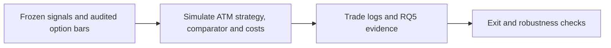

# RQ5 0DTE SPX Options Backtest

**Executable:** `notebooks/15_rq5_options_backtest.ipynb`
**Status:** I use this in the main dissertation workflow.

## Purpose

Here I finally test the frozen RQ1-RQ3 rule with 0DTE SPX options. I wanted to see what the result looks like after adding less generous entry and exit prices, not just under perfect execution.

## Workflow

## Inputs

- Saved RQ5 option bars and contract map
- Frozen candidate sessions
- RQ1 direction and 60-minute mean-reversion comparator

## Processing and rationale

- I use the planned ATM contract and the same entry and exit bars for every trade.
- I run frictionless, low, medium and severe cost assumptions.
- I also compare the ML direction with mean reversion and check affordability, strike choice, regimes and bootstrap uncertainty.

## Outputs

- `outputs/rq5_options_trading/backtest/`
- RQ5 summary, comparator, cost, affordability, regime and bootstrap tables
- `outputs/rq5_options_trading/rq5_backtest_manifest.json`

## Representative outputs

*This plot shows the cumulative path of the frozen strategy after the medium transaction-cost assumption.*

*This plot shows the trade-off between cheaper contracts and the resulting strategy outcomes.*

## Findings and decisions

- Across 17 historical trades, the ATM ML strategy made $11,855 before costs and was still positive under the planned medium-cost case.
- On those same dates, the ML direction didn't consistently beat the 60-minute mean-reversion rule.
- The bootstrap ranges were wide, so I wouldn't treat the positive P&L as a reliable expected return.

## Limitations

- The biggest issue is that there are only 17 main trades and no historical bid-ask quotes.
- The costs are synthetic, the dates are from development, and 0DTE results depend heavily on the path taken during the hour.

## Next steps

- Next I test the planned stop/take-profit rule and check how much the result depends on a few trades.
