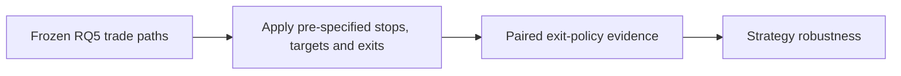
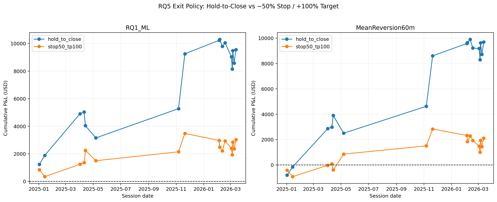
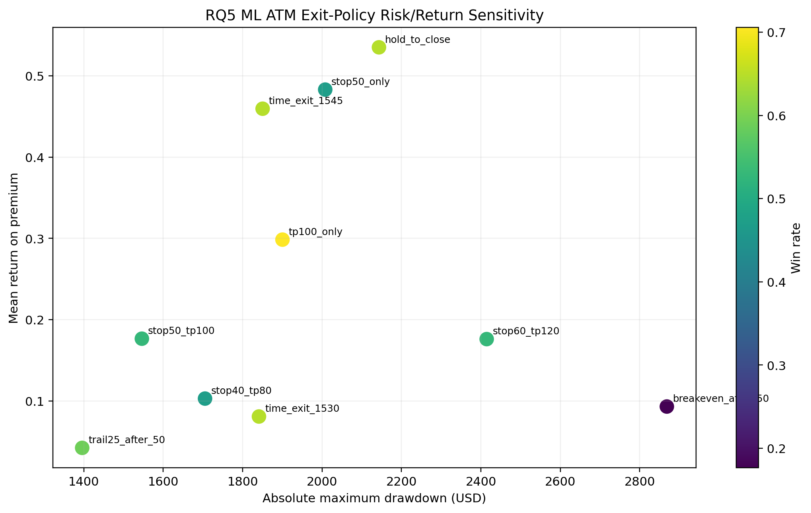

# RQ5 Exit Strategy Sensitivity

**Executable:** `notebooks/16_rq5_exit_strategy_sensitivity.ipynb`
**Status:** I use this in the main dissertation workflow.

## Purpose

I compare the normal hold-to-close trade with a 50% stop and 100% target here. The other exit ideas are included as checks, not as a search for whichever rule looks best afterwards.

## Workflow

## Inputs

- RQ5 candidate sessions, contract selection and option-minute bars
- Frozen execution-cost scenarios

## Processing and rationale

- I replay the minute path and use a conservative rule if a stop and target could both have happened in the same bar.
- I compare every policy on the same trades, strikes and cost assumptions.
- I record how often each rule triggers, how long it holds and what it changes for P&L and drawdown.

## Outputs

- `outputs/rq5_options_trading/exit_strategy_sensitivity/`
- Exit-policy, paired-comparison, trigger and path-diagnostic tables

## Representative outputs

*This plot shows the paired trade-level effect of the principal stop-loss and take-profit rule.*

*This plot shows the return and drawdown trade-offs across the pre-specified exit policies.*

## Findings and decisions

- The medium-cost ATM hold-to-close comparison produced $9,551 in the saved run.
- The main stop/target rule changes both return and drawdown, but I compare it with holding those exact same trades.
- If the one-minute bar is ambiguous, I assume the stop happened first. That is the less favourable choice.

## Limitations

- Minute OHLC bars don't show whether the stop or target was touched first inside the minute.
- The extra exit policies are development checks and haven't been validated on new trades.

## Next steps

- I next look at the biggest winners, what happened after a stop and equal-capital multi-contract examples.
