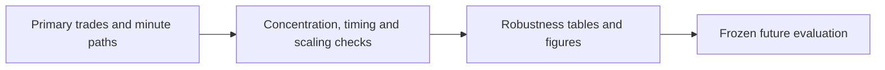
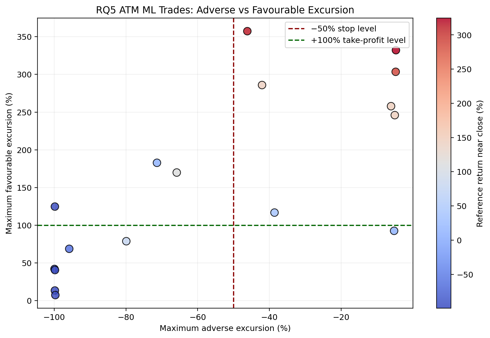
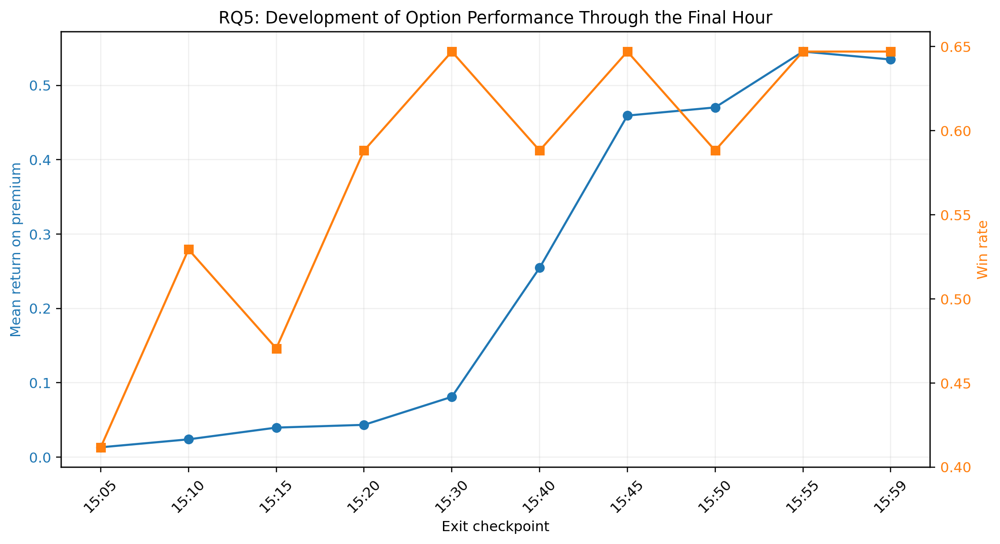
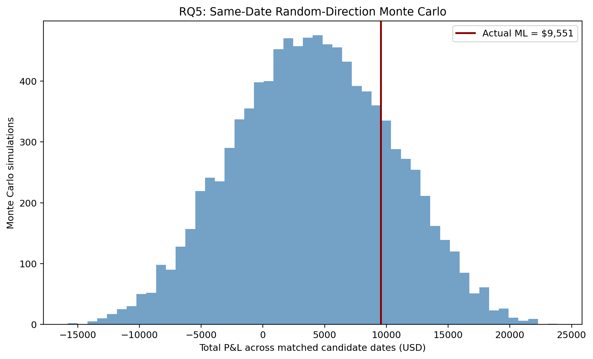

# 17 - Checking Whether a Few Trades Drive RQ5

**File:** [notebooks/17_rq5_strategy_robustness_and_multi_contract.ipynb](../../notebooks/17_rq5_strategy_robustness_and_multi_contract.ipynb)

**How I use it:** This is the final development robustness notebook for RQ5. It tries to explain the result rather than invent a better-looking one.

## The short version

The main backtest has only 17 trades, so one or two winners can completely change the story. Here I remove top trades, inspect recoveries after stop/target touches, follow P&L through the hour, compare calls with puts and test whether ML direction beats random choices. I also model simple multi-contract exits, but always compare them with holding the same number of contracts so extra capital is not mistaken for skill.

## Where it sits in the workflow

This notebook is mostly about reasons not to overclaim the backtest. That is useful evidence, even when it makes the headline result less exciting.

## What it needs

- The primary RQ5 trade log.
- Candidate-session and contract-selection tables.
- Saved option-minute paths and path diagnostics.
- Fixed cost, strike and account-capital assumptions.

## What I actually do here

I break the result apart several ways so I can see whether it survives common sense checks.

- Top winners are removed one at a time and their share of total P&L is recorded.
- I check what happened after stop and target levels were first touched.
- P&L and win rate are summarised at checkpoints through the final hour.
- Calls, puts and random-direction simulations are compared with the actual signal direction.
- Break-even cost and leave-one-trade-out tables show how much room there is for execution error.
- Multi-contract scaling is compared with a same-size hold benchmark and the capital required is shown explicitly.

A strategy that only looks good after using more contracts or keeping one exceptional winner is not robust, even if its final dollar P&L is large.

## What it creates

- Profit-concentration, top-winner and leave-one-out tables.
- Stop/target recovery, timing and random-direction evidence.
- Break-even execution-cost and account-exposure tables.
- Multi-contract trade logs, summaries, figures and a robustness manifest.

## Outputs worth opening

*This shows how much each option moved for and against the trade before the final exit.*

*I use this to see whether the edge appears early, late or only at the last bar.*

*This is a useful reality check on whether the observed direction choice is unusual relative to random calls and puts on the same opportunities.*

The [profit concentration](../../outputs/rq5_options_trading/tables/rq5_profit_concentration.csv), [stop recovery](../../outputs/rq5_options_trading/tables/rq5_stop50_recovery_summary.csv), [paired ML comparison](../../outputs/rq5_options_trading/tables/rq5_paired_ml_vs_mean_reversion_summary.csv) and [multi-contract summary](../../outputs/rq5_options_trading/tables/rq5_multi_contract_summary.csv) hold the main numbers.

## What I took from it

- The largest trade contributed about 41.6% of the main strategy's net P&L.
- About 44.4% of trades that touched -50% later recovered to entry, and about 22.2% later reached +100%.
- Multi-contract rules produced more raw dollars because they used more capital, but they underperformed simply holding the same number of contracts in this sample.
- The robustness checks made the limited sample and path dependence impossible to ignore, which is exactly their purpose.

## Things I wouldn't overclaim

- Nearly every check still uses the same 17 development dates.
- Monte Carlo direction comparisons reuse the available option paths and do not create new market regimes.
- Account examples illustrate required scale; they are not personal investment advice or evidence of live executability.

## What I run next

I freeze the development workflow here. The next honest check is [18 - the post-freeze holdout](18_fresh_holdout_end_to_end_evaluation.md), with no rule changes based on these later outcomes.
