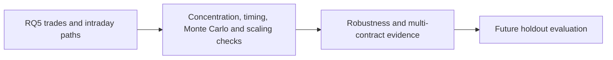

# RQ5 Strategy Robustness and Multi-Contract Scaling

**Executable:** `notebooks/17_rq5_strategy_robustness_and_multi_contract.ipynb`
**Status:** I use this in the main dissertation workflow.

## Purpose

The backtest only has a small number of trades, so I use this notebook to see what is driving the result. I look at big winners, recoveries, timing, option side, random directions and multi-contract exits.

## Workflow

## Inputs

- Primary RQ5 trade log
- Selected contracts, candidate sessions and option-minute bars

## Processing and rationale

- I remove the top trades one at a time and check how concentrated the profit is.
- I track what happens after a stop or target touch and how P&L develops through the hour.
- For the multi-contract ideas, I compare them with simply holding the same number of contracts and show the capital that would have been needed.

## Outputs

- `outputs/rq5_options_trading/strategy_robustness/`
- Concentration, recovery, timing, random-direction, break-even-cost and multi-contract tables

## Representative outputs

*This plot shows the favourable and adverse intraday paths behind the final trade outcomes.*

*This plot shows when gains and losses develop during the final trading hour.*

## Findings and decisions

- The largest trade made up about 41.6% of the main strategy's net P&L.
- Of the trades that touched -50%, around 44.4% got back to entry and 22.2% later reached +100%. That shows why a hard stop changes the result so much.
- The multi-contract rules made more raw dollars by using more capital, but they did worse than holding the same number of contracts in this sample.

## Limitations

- Most of these checks still come from the same 17 dates.
- The account-size examples are there to show scale and aren't personal investment advice.

## Next steps

- I keep the main rule fixed from here and only judge it again when genuinely new option data is available.
