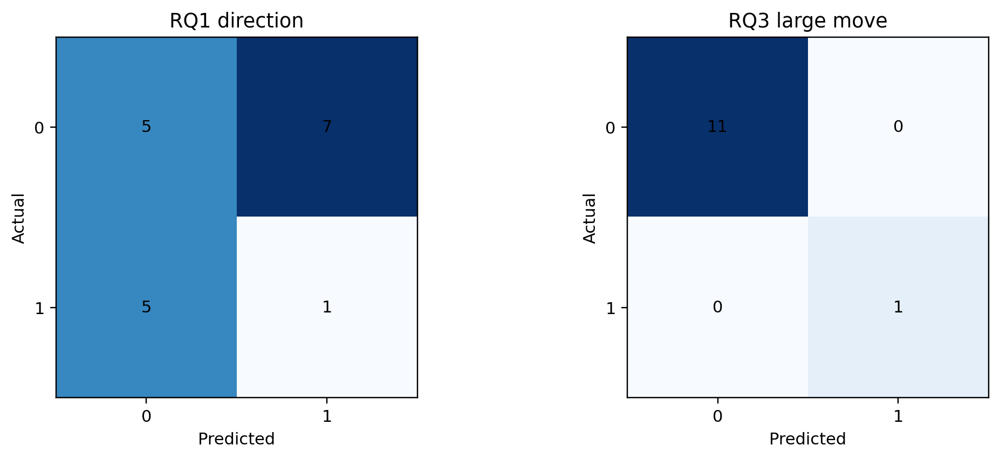
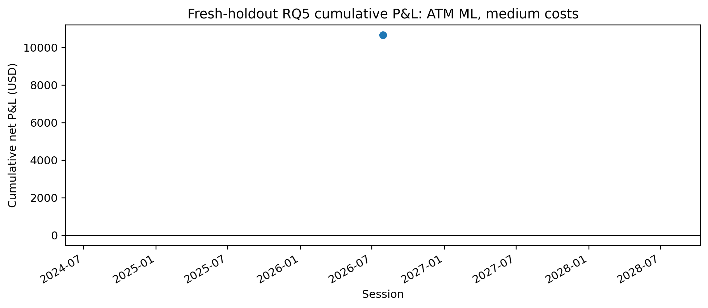

# 18 - Fresh Holdout End-to-End Evaluation

**File:** [notebooks/18_fresh_holdout_end_to_end_evaluation.ipynb](../../notebooks/18_fresh_holdout_end_to_end_evaluation.ipynb)

**Role in the project:** This has now been run once for 20 July to 19 August 2026. Those dates are consumed holdout evidence and must not be used for tuning.

## Overview

This notebook downloads only observations after the previously viewed cutoff, rebuilds the same features, verifies the saved model hashes and scores the frozen RQ1-RQ3 models without calling `fit`. It then applies the fixed RQ4 filters and retrieves options only for dates selected by those rules. The result is mixed, which is useful: RQ1 generalised poorly, RQ2 had limited magnitude skill, while RQ3 and the combined rule caught one extreme down day that produced one very profitable hypothetical put trade.

## Workflow

This is a post-freeze temporal check, not a new development loop. Once the outcomes were viewed, the period could no longer be described as untouched.

## Inputs

- `main.env` and the Massive API.
- Hashed classical artifacts and manifests under `models/classical/`.
- Optional exploratory LSTM artifacts and scalers.
- The frozen RQ1 confidence distance, RQ2 20-bps threshold and RQ3 large-move rule.
- The original RQ5 strike, cost, entry, exit and stop/target assumptions.

## Processing

The notebook does retrieval, processing, scoring and strategy evaluation in one controlled run so the newer dates are not explored in separate steps first.

- The start date is fixed after 17 July and the end date is the latest completed US session at run time.
- SPY, SPX and VIX are stored in an isolated holdout folder and aligned backwards using the original rules.
- All 22 classical features are recreated and the saved artifact hashes are checked before prediction.
- RQ1/RQ3 classification and RQ2 regression metrics are calculated without refitting or threshold changes.
- The combined RQ4 rule is applied using its development-period confidence cutoff.
- Only the selected session reaches option retrieval and the same ATM/OTM, cost and exit sensitivities are evaluated.
- A final manifest records that the holdout has been consumed.

A weak or mixed result does not lead to changes within this notebook. Any future model change needs a later, genuinely new evaluation period.

## Outputs

- Isolated raw, aligned and daily holdout data under `data/fresh_holdout_post_2026_07_17/`.
- Classification, regression, RQ4, candidate-session and LSTM tables.
- Option contract, trade, strategy and exit-policy evidence.
- Two figures and `fresh_holdout_manifest.json` under the dated output folder.

## Key outputs and figures

*The contrast is immediate: RQ1 struggled, while RQ3 correctly separated the one large-move event from eleven ordinary strict sessions.*

*This is only one trade, so I treat it as a case-study point rather than a meaningful equity curve.*

The [classification metrics](../../outputs/fresh_holdout_post_2026_07_17/20260718_20260819/tables/fresh_holdout_classification_metrics.csv) show RQ1 at 33.3% accuracy versus 61.1% for mean reversion, and RQ3 at 12/12 on the strict subset. [RQ2 metrics](../../outputs/fresh_holdout_post_2026_07_17/20260718_20260819/tables/fresh_holdout_regression_metrics.csv) record MAE of about 12.96 bps and weak-to-moderate rank association. The selected 29 July session is in the [candidate table](../../outputs/fresh_holdout_post_2026_07_17/20260718_20260819/tables/fresh_holdout_rq5_candidate_sessions.csv), with its option result in the [trade log](../../outputs/fresh_holdout_post_2026_07_17/20260718_20260819/options/fresh_holdout_option_trade_log.csv).

## Findings and decisions

- RQ1 failed to generalise: 6 of 18 directions were correct, well below the 11 of 18 mean-reversion benchmark.
- RQ2 gave some limited magnitude information but predicted only about 25.11 bps for the 164.91-bps extreme move.
- RQ3 correctly identified the only large move among 12 strict sessions, but one positive event is far too little for a strong reliability claim.
- The combined rule selected only 29 July, correctly predicted down and produced a medium-cost ATM put profit of about $10,664.90 on about $1,184.85 capital at risk.
- The ML and mean-reversion option strategies were identical on that date because both chose a put.
- Only 12 of 23 sessions met the strict rule, mainly because later VIX gaps reduced coverage.

## Limitations and considerations

- The relaxed sample was 18 sessions and the strict RQ3/RQ4 sample only 12, with one positive large-move event.
- One winning trade cannot support a Sharpe ratio, stable win rate, profit factor or general profitability conclusion.
- The option bars remain trade-derived rather than historical NBBO quotes.
- The fresh results can be reported and discussed, but must not be used to alter these same models and then retested as if still unseen.

## Next stage

I preserve this output folder unchanged and use it as a short post-freeze validation section in the dissertation. If I redesign a model later, I need to wait for a newer evaluation period rather than reusing July-August 2026.
