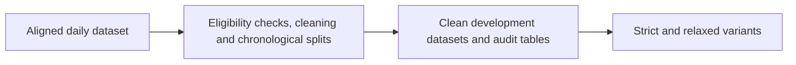

# Dataset Cleaning and Pre-Modelling Setup

**Executable:** `notebooks/cleaning_modellingprep.ipynb`  
**Status:** I use this in the main dissertation workflow.

## Purpose

Here I tidy up the aligned daily data and get it ready for modelling. I also keep a record of the sessions I remove, as I didn't want the cleaning choices to become a hidden part of the project.

## Workflow

## Inputs

- `data/derived/daily_underlying_model_dataset.parquet`
- `data/derived/underlying_session_audit.parquet`

## Processing and rationale

- I remove duplicates, partial sessions, early closes and rows where the timing doesn't make sense.
- I check for missing values, infinite values, constant columns and features that are almost copies of each other.
- For imputation and clipping, I learn the values from the training rows only. This is important because using later rows would leak information backwards.

## Outputs

- `data/derived/daily_underlying_model_dataset_clean.parquet`
- `data/derived/daily_underlying_model_dataset_clean_split.parquet`
- `data/derived/daily_underlying_model_dataset_model_ready.parquet`
- `outputs/cleaning/`

## Representative outputs

*This plot shows how the direction-label balance changes across plausible neutral-return thresholds.*

The exact cleaning rules and retained rows are recorded in the [cleaning manifest](../../outputs/cleaning/cleaning_manifest.json).

## Findings and decisions

- The strict version left me with 434 sessions for the binary target.
- The duplicate, target formula and look-ahead checks all passed in the saved run.
- Some features were very highly correlated, so I keep the preprocessing inside each training fold later on.

## Limitations

- The strict checks make the already small daily sample even smaller.
- The ready-made table is handy for quick benchmarks, but it isn't a replacement for fitting preprocessing properly inside validation.

## Next steps

- The next job is to make strict and relaxed versions using the same date boundaries.
