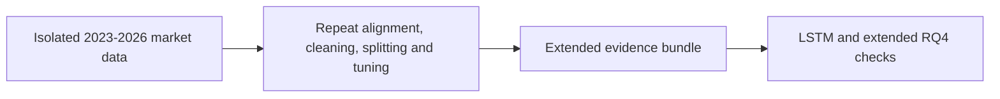

# Extended 2023-2026 Underlying-Market Pipeline

**Executable:** `notebooks/extended_2023_2026_full_pipeline.ipynb`  
**Status:** I use this in the main dissertation workflow.

## Purpose

I used this notebook to repeat most of the market-data pipeline on a separate 2023-2026 dataset. I kept it isolated so I wouldn't accidentally overwrite the original data or results.

## Workflow

## Inputs

- Massive API access through `main.env`
- `data_extended_2023_2026/`
- Shared helper functions in `scripts/massive_database.py`

## Processing and rationale

- I download and register the longer minute history in its own database area.
- I rebuild the same pre-15:00 features and the strict/relaxed datasets.
- I then repeat the baseline, tuning and robustness work using the same general time-split rules.

## Outputs

- `data_extended_2023_2026/`
- `outputs/extended_2023_2026/`

## Representative outputs

*This plot shows the descriptive relationships after expanding the underlying-market history.*

*This plot shows the time-aware RQ1 performance across extended-history outer folds.*

## Findings and decisions

- This run chose strict Extra Trees for RQ1, relaxed RBF SVR for RQ2 and a strict reduced-feature RBF SVC for RQ3.
- I use this as a check on the original findings, not as a replacement for the main RQ1-RQ5 results.
- Anything after 17 July 2026 is still kept outside this development dataset.

## Limitations

- This notebook does a lot in one place and takes a long time to rerun. The main pipeline is easier to inspect because its stages are split up.
- The longer history is still development data, so it isn't a completely fresh final test.

## Next steps

- I use these outputs for the LSTM experiment and the extended RQ4 check.
