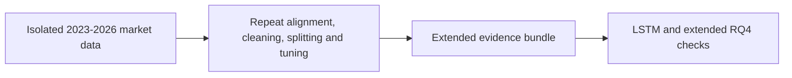
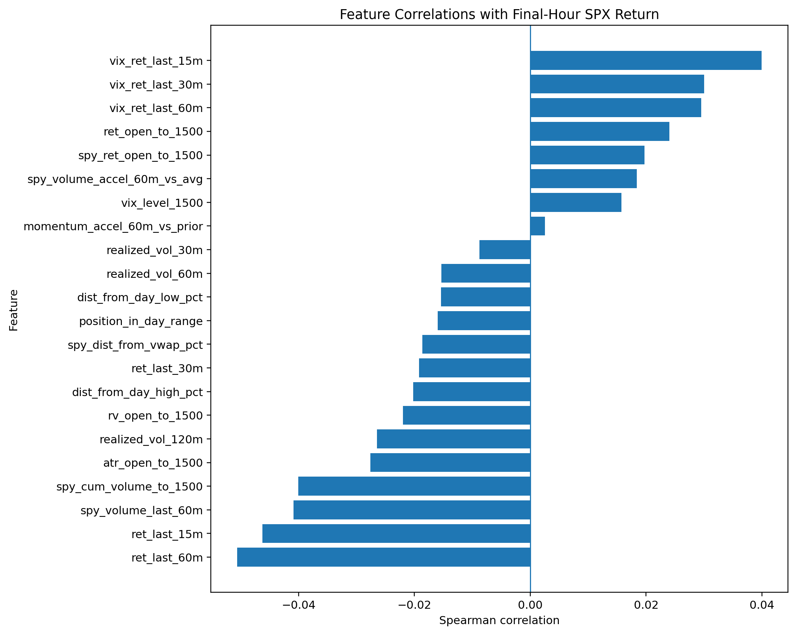

# Extended 2023-2026 Underlying-Market Pipeline

**Executable:** `notebooks/extended_2023_2026_full_pipeline.ipynb`  
**Status:** Part of the maintained dissertation workflow.

## Purpose

I repeat the underlying retrieval, alignment, cleaning, modelling and robustness workflow on an isolated 2023-2026 dataset.

## Workflow

## Inputs

- Massive API access through `main.env`
- `data_extended_2023_2026/`
- Shared helper functions in `scripts/massive_database.py`

## Processing and rationale

- Retrieve and register extended minute history without changing the original database.
- Recreate look-ahead-safe features and strict/relaxed variants.
- Repeat baseline, nested tuning and robustness analysis with the protected date design.

## Outputs

- `data_extended_2023_2026/`
- `outputs/extended_2023_2026/`

## Representative outputs

*Figure: the descriptive relationships after expanding the underlying-market history.*

*Figure: the time-aware RQ1 performance across extended-history outer folds.*

## Findings and decisions

- The extended tuning selected strict Extra Trees for RQ1, relaxed RBF SVR for RQ2 and strict reduced-feature RBF SVC for RQ3.
- The isolated run supports a robustness comparison rather than replacing the original RQ1-RQ5 results.
- Data after 17 July 2026 remain outside this development dataset.

## Limitations

- This long notebook is expensive to rerun and combines several stages that are easier to audit separately in the main workflow.
- The extension is still development-period evidence rather than a fresh final holdout.

## Next steps

- Use the extended outputs for the LSTM and extended RQ4 sensitivity analyses.
