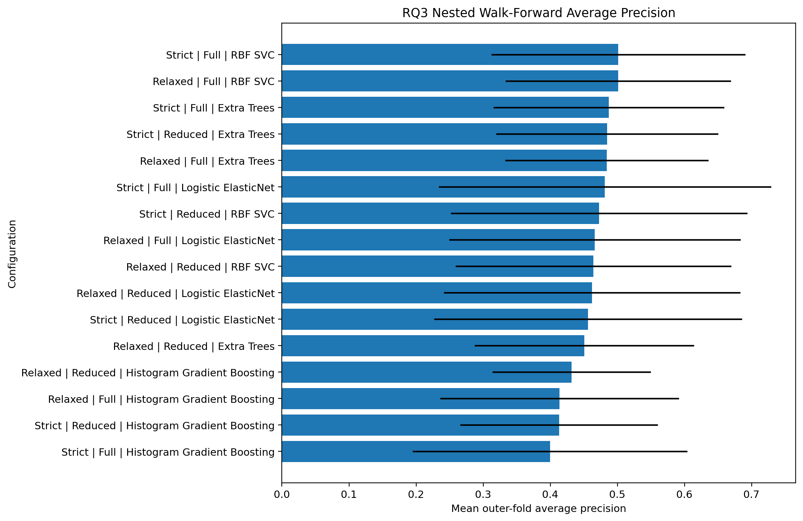

# Hyperparameter Tuning and Threshold Optimisation

**Executable:** `notebooks/hyperparameters_tuning.ipynb`  
**Status:** I use this in the main dissertation workflow.

## Purpose

This is where I tune the shortlisted RQ1-RQ3 models. I leave the test switch off because that test period had already been looked at in the baseline work.

## Workflow

## Inputs

- Strict and relaxed split datasets
- Baseline model and feature-set decisions

## Processing and rationale

- I run nested expanding-window searches for the classification and regression models.
- For RQ1 and RQ3, I choose the classification cut-off inside the development folds rather than using 0.5 automatically.
- Once the searches are done, I save the chosen settings without using a fresh holdout.

## Outputs

- `outputs/hyperparameter_tuning/tables/`
- `outputs/hyperparameter_tuning/figures/`
- `outputs/hyperparameter_tuning/final_tuned_configuration_manifest.json`
- `outputs/hyperparameter_tuning/nested_tuning_dissertation_draft.md`

## Representative outputs

*This plot shows RQ1 balanced accuracy across the nested chronological folds used for model selection.*

*This plot shows RQ3 average precision relative to the class-imbalance challenge.*

## Findings and decisions

- The chosen models were relaxed Histogram Gradient Boosting for RQ1, relaxed RBF SVR for RQ2 and strict RBF SVC for RQ3.
- RQ1 averaged roughly 0.544 balanced accuracy across the outer folds. That is some evidence, but it is weak and not very stable.
- I treat the nested development results as the main evidence here, not the test block that had already been seen.

## Limitations

- There are only three outer and three inner splits, mainly because the daily sample is small.
- More tuning can't fix a limited sample or create options information that isn't in the features.

## Next steps

- Next I check the winners against matched benchmarks, changing regimes, feature stability and confidence coverage.
