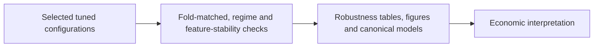
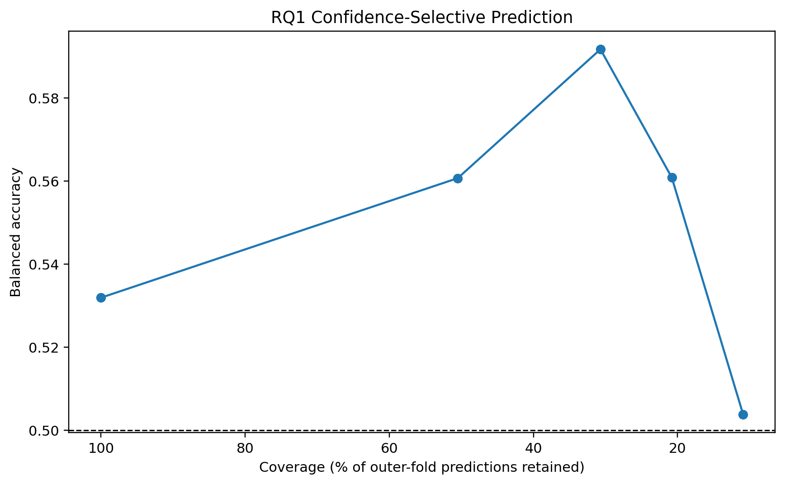
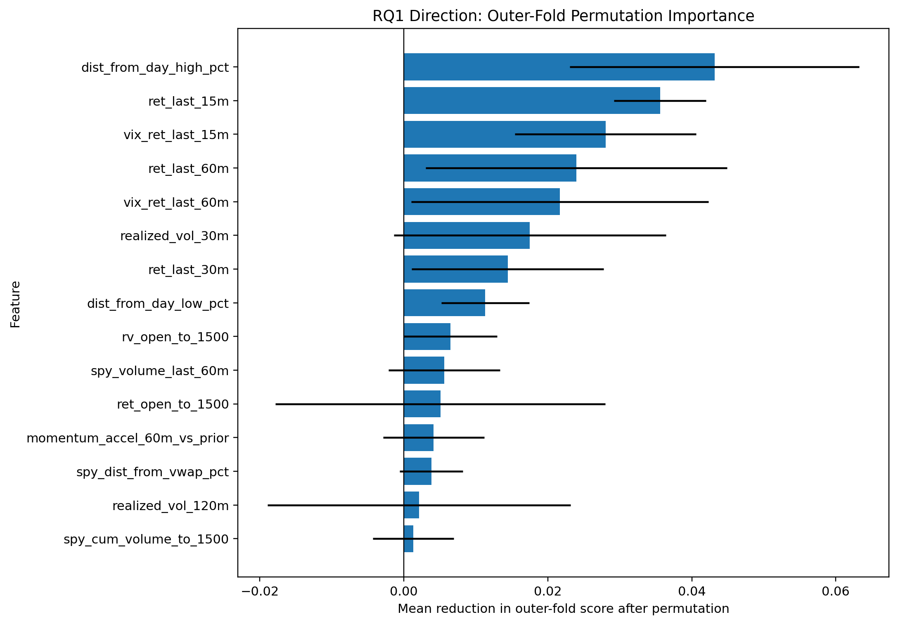

# Tuned-Model Robustness Analysis

**Executable:** `notebooks/hyperparameters_tuning_extended_robustness.ipynb`  
**Status:** Part of the maintained dissertation workflow.

## Purpose

I test whether the selected tuned models remain credible under fold-matched benchmarks, feature-stability checks, market regimes and confidence-based coverage.

## Workflow

## Inputs

- Strict and relaxed split datasets
- Frozen tuned configurations

## Processing and rationale

- Reproduce selected winners inside the same outer folds as their benchmarks.
- Estimate feature importance and regime thresholds using training information only.
- Measure RQ1 performance as coverage is reduced to higher-confidence sessions.

## Outputs

- `outputs/hyperparameter_tuning/tables/selected_winner_outer_fold_predictions.csv`
- `outputs/hyperparameter_tuning/tables/fold_matched_benchmark_summary.csv`
- Feature-stability, regime and selective-prediction tables

## Representative outputs

*Figure: the trade-off between acting on fewer high-confidence sessions and retaining usable coverage.*

*Figure: the stability of feature contributions across chronological outer folds.*

## Findings and decisions

- RQ1 confidence filtering improved balanced accuracy at some lower-coverage levels, but the relationship was not uniformly stable.
- Regime results vary, reinforcing that unconditional directional performance is weak.
- The selected outputs become the bridge into the economic-meaningfulness analysis.

## Limitations

- All checks use development-period observations after model-family selection.
- Subgroup and high-confidence samples are small and descriptive.

## Next steps

- Freeze configurations for a future holdout and evaluate economic opportunity concentration in RQ4.
