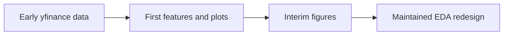

# Legacy 01 - My First Proper Look at the Intraday Data

**File:** [notebooks/legacy/01_EDA.ipynb](../../../notebooks/legacy/01_EDA.ipynb)

**How I use it:** I keep this as project history. It helped shape the later work, but it is not part of the final evidence pipeline.

## The short version

This was the notebook where I first tried to make sense of the intraday SPX, SPY and VIX data. I tested some early features, looked at final-hour returns and ran a few simple models just to see whether the overall idea had any signal at all. A lot changed afterwards, especially the data source, alignment checks and validation design, so I would not quote these numbers as final results.

## Where it sits in the workflow

This sits before the numbered maintained workflow. It explains where several ideas came from, not how the final dataset was produced.

## What it needs

- Short-window SPX, SPY and VIX intraday downloads from yfinance.
- Early versions of the session times, targets and feature names.
- The notebook's own exploratory settings rather than the later frozen config.

## What I actually do here

I was mainly asking whether the dissertation idea was workable before spending time on the larger database pipeline.

- I reshape and combine the three market series by session.
- I inspect missing values, return distributions, correlations and simple feature relationships.
- I create early versions of the final-hour direction and movement targets.
- I try small logistic-regression checks to see whether the features behave sensibly.
- I save a couple of figures that were useful in the interim report.

The useful output was the list of problems to fix: short history, loose alignment and a validation design that needed to be much more careful.

## What it creates

- Tables and plots stored inside the notebook.
- Two retained interim-report figures below `outputs/Images/Interim-Report/`.
- Early feature and target ideas that were rebuilt later in notebooks 03-05.

## Outputs worth opening

*This was my first visual check of the outcome I wanted to model. It is useful background, but the maintained pipeline later rebuilt the data more carefully.*

*This helped me decide which feature families were worth carrying forward. It should not be confused with the later nested feature-importance result.*

The remaining exploratory tables are still visible in the [legacy notebook](../../../notebooks/legacy/01_EDA.ipynb).

## What I took from it

- The final-hour target was variable enough to be interesting but clearly noisy.
- Momentum, volatility and price-positioning ideas looked worth testing in a better pipeline.
- The exercise exposed how risky it would be to trust randomly split or very short intraday data.

## Things I wouldn't overclaim

- The yfinance intraday history was short and could change on rerun.
- The timestamp matching and leakage controls were not yet the final versions.
- The small model checks were exploratory and were not nested or independently evaluated.

## What I run next

For anything I cite as maintained data evidence, I move to [03 - aligned EDA](../03_aligned_eda.md).
