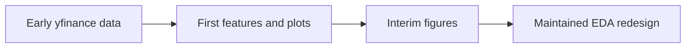
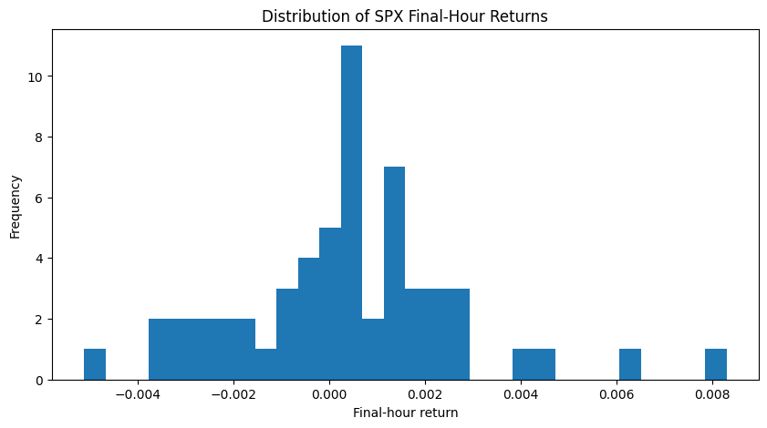
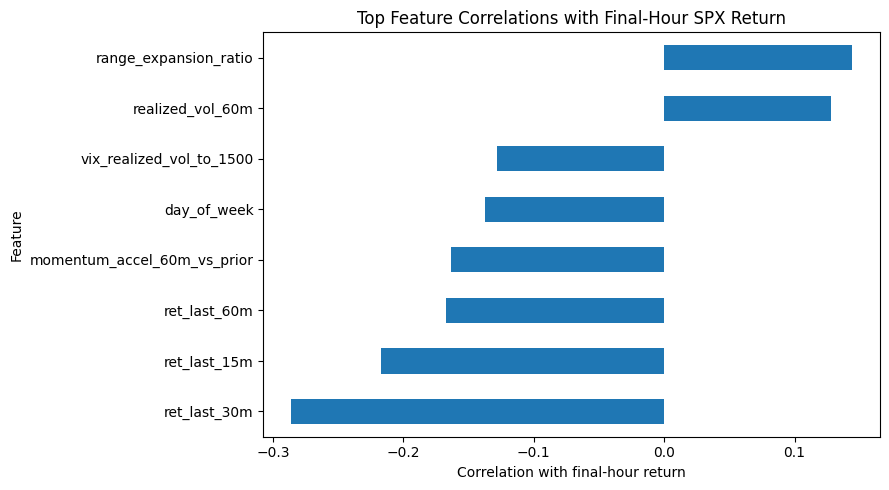

# Legacy 01 - Preliminary Exploratory Data Analysis

**File:** [notebooks/legacy/01_EDA.ipynb](../../../notebooks/legacy/01_EDA.ipynb)

**Role in the project:** This is retained as project history. It helped shape the later work but is not part of the final evidence pipeline.

## Overview

This notebook contains the first exploratory review of the intraday SPX, SPY and VIX data. It tests early features, examines final-hour returns and runs simple models to assess whether the overall idea warranted further development. The data source, alignment checks and validation design were later replaced, so these figures are retained as preliminary evidence only.

## Workflow

This sits before the numbered maintained workflow. It explains where several ideas came from, not how the final dataset was produced.

## Inputs

- Short-window SPX, SPY and VIX intraday downloads from yfinance.
- Early versions of the session times, targets and feature names.
- The notebook's own exploratory settings rather than the later frozen config.

## Processing

I was mainly asking whether the dissertation idea was workable before spending time on the larger database pipeline.

- I reshape and combine the three market series by session.
- I inspect missing values, return distributions, correlations and simple feature relationships.
- I create early versions of the final-hour direction and movement targets.
- I try small logistic-regression checks to see whether the features behave sensibly.
- I save a couple of figures that were useful in the interim report.

The useful output was the list of problems to fix: short history, loose alignment and a validation design that needed to be much more careful.

## Outputs

- Tables and plots stored inside the notebook.
- Two retained interim-report figures below `outputs/Images/Interim-Report/`.
- Early feature and target ideas that were rebuilt later in notebooks 03-05.

## Key outputs and figures

*This was the first visual check of the modelling outcome. It provides useful background, although the maintained pipeline later rebuilt the data with stronger controls.*

*This informed the feature families carried into later development. It is separate from the nested feature-importance result in the maintained pipeline.*

The remaining exploratory tables are still visible in the [legacy notebook](../../../notebooks/legacy/01_EDA.ipynb).

## Findings and decisions

- The final-hour target was variable enough to be interesting but clearly noisy.
- Momentum, volatility and price-positioning ideas looked worth testing in a better pipeline.
- The exercise exposed how risky it would be to trust randomly split or very short intraday data.

## Limitations and considerations

- The yfinance intraday history was short and could change on rerun.
- The timestamp matching and leakage controls were not yet the final versions.
- The small model checks were exploratory and were not nested or independently evaluated.

## Next stage

For anything I cite as maintained data evidence, I move to [03 - aligned EDA](../03_aligned_eda.md).
