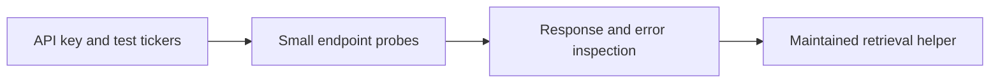

# Legacy 02 - Initial Massive API Access Testing

**File:** [notebooks/legacy/02_API-initial.ipynb](../../../notebooks/legacy/02_API-initial.ipynb)

**Role in the project:** This is an access experiment, not the downloader used for the final research data.

## Overview

Before building a database around Massive, I needed to find out what my subscription actually included. This notebook contains small test calls for underlying aggregates, option contracts and option history. It remains exploratory because I was learning the response shapes, date rules and entitlement errors before writing a reusable retrieval layer.

## Workflow

Nothing from here is treated as a research result. It is an early API testing record and a record of why the later downloader was designed the way it was.

## Inputs

- A Massive API key loaded locally.
- A few recent dates, underlying symbols and option tickers.
- Small request limits so I could inspect responses without downloading the full history.

## Processing

I test one thing at a time so I can tell whether a failure comes from the request, the date, the ticker format or the subscription.

- I request a small underlying aggregate sample and inspect its columns.
- I search the contract-reference endpoint and check SPX/SPXW symbol conventions.
- I try historical option aggregates and note which dates return bars.
- I display status messages and raw tables rather than hiding failed requests.
- I use the findings to decide what belongs in `massive_database.py`.

The main lesson was that a visible contract does not guarantee every historical field or every old option bar is included in the plan.

## Outputs

- Notebook-only response tables and error messages.
- Examples of contract metadata and aggregate schemas.
- A practical list of entitlement limits that informed the maintained retrieval workflow.

## Key outputs and figures

There is no separate chart worth preserving from this test. The useful outputs are the small response tables and entitlement messages kept inside the [legacy API notebook](../../../notebooks/legacy/02_API-initial.ipynb). The maintained evidence starts with the [underlying session audit](../../../data/derived/underlying_session_audit.parquet), which is produced by the later workflow.

## Findings and decisions

- Underlying minute aggregates were suitable for the main feature pipeline.
- Contract discovery and aggregate access did not automatically include Greeks, implied volatility, open interest or full quote history.
- Old 0DTE option availability needed to be logged explicitly because some requests returned no bars.

## Limitations and considerations

- Provider plans and rolling history can change after this notebook was run.
- These were deliberately tiny requests and do not prove that a full multi-year download will finish.
- Any credentials remain local and are not part of the documentation.

## Next stage

I moved the repeatable request, retry, Parquet and DuckDB logic into [the Massive database helper](../../scripts/massive_database.md).
