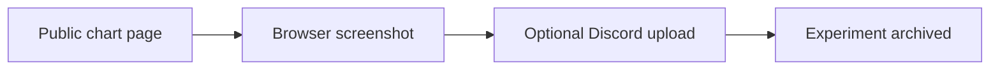

# Legacy 04 - Testing a Gamma-Chart Screenshot and Discord Message

**File:** [notebooks/legacy/04_disc-gamma.ipynb](../../../notebooks/legacy/04_disc-gamma.ipynb)

**How I use it:** This is a browser-automation experiment. It was never used as model input or dissertation evidence.

## The short version

I wanted to see whether a public gamma-exposure page could be captured automatically and sent to Discord. The test worked as an automation idea, but an image from a changing webpage is not the kind of structured, historical and reproducible input I needed for the dissertation. I therefore kept the experiment but separated it from the proper data pipeline.

## Where it sits in the workflow

The file is useful for showing what I tried, but no arrow from it enters the research workflow.

## What it needs

- The public gamma-exposure webpage.
- A local Discord webhook when message delivery is enabled.
- A Chromium browser controlled through Playwright.

## What I actually do here

The notebook automates the same actions I would otherwise do manually in a browser.

- I open the page and wait for its chart content.
- I handle the cookie prompt if it appears.
- I take a screenshot and inspect whether the important chart area is visible.
- I optionally send the image through the local webhook.
- I keep secrets outside the notebook and Git history.

This proved the browser idea, but it also showed why screenshots are a poor foundation for repeatable historical analysis.

## What it creates

- A temporary local screenshot when the notebook is run.
- An optional Discord message.
- No maintained table, research figure or model artifact.

## Outputs worth opening

The output is intentionally not kept in the dissertation folders because it can contain a live webpage capture. The code and its displayed run remain in the [legacy gamma notebook](../../../notebooks/legacy/04_disc-gamma.ipynb). The related standalone experiments are documented in [the full-page script](../../scripts/legacy/disc-gamma.md) and [the cropped-chart script](../../scripts/legacy/disc-gamma-svg.md).

## What I took from it

- Browser automation could capture and forward the chart.
- The chart layout and anti-automation behaviour were too fragile for a research data source.
- I chose licensed, timestamped API data for the models instead.

## Things I wouldn't overclaim

- Page layout, selectors and access rules can change without notice.
- A screenshot does not expose reliable historical values for modelling.
- The optional message is an external side effect, so it stays disabled unless configured locally.

## What I run next

This branch stops here. The maintained data route is explained in [the central workflow](../../workflow.md).
