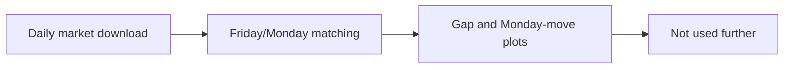

# Legacy 05 - Exploring Weekend Gaps Before I Fixed the Final Topic

**File:** [notebooks/legacy/05_yfinance_weekend_gap_analysis.ipynb](../../../notebooks/legacy/05_yfinance_weekend_gap_analysis.ipynb)

**How I use it:** This is another early pattern check and is kept only as provenance.

## The short version

This notebook looks at the gap from a Friday close to the next Monday open and then asks what happened during Monday. It was part of my early search for a workable market question. Once the dissertation became about predicting the SPX final hour, this analysis stopped being relevant, so I did not try to polish it into a second backtest.

## Where it sits in the workflow

It is outside the numbered pipeline and has no effect on the final data, models, thresholds or trades.

## What it needs

- Daily OHLC prices downloaded through yfinance.
- Trading dates used to locate the next available Monday after each Friday.

## What I actually do here

I use a paired view because the Friday close and Monday session belong to the same weekend observation.

- I identify Friday closes and the next valid Monday.
- I calculate the weekend opening gap.
- I compare the gap with Monday's intraday direction and range.
- I display paired tables and charts inside the notebook.
- I do not export or combine these rows with the SPX dissertation dataset.

The exercise was useful for learning and narrowing the topic, but it was not strong enough to justify extra research questions.

## What it creates

- Notebook-only paired tables.
- Exploratory weekend-gap and Monday-move charts.
- No maintained output file or saved model.

## Outputs worth opening

The original plots remain in the [weekend-gap legacy notebook](../../../notebooks/legacy/05_yfinance_weekend_gap_analysis.ipynb). I deliberately leave them there rather than mixing an abandoned yfinance experiment into the final `outputs/` evidence.

## What I took from it

- Weekend gaps were easy to describe but harder to turn into a stable and testable strategy.
- The live download and limited controls made any apparent pattern fragile.
- Focusing on one SPX intraday problem gave the dissertation a much clearer data and evaluation design.

## Things I wouldn't overclaim

- The sample changes when the live download is rerun.
- There is no frozen split, cost model or nested validation.
- Simple weekday matching needs care around holidays and missing sessions.

## What I run next

This experiment ends here. I use [the numbered notebook workflow](../../workflow.md) for the actual dissertation.
