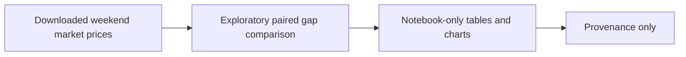

# Legacy Weekend Gap Analysis

**Executable:** `notebooks/legacy/05_yfinance_weekend_gap_analysis.ipynb`
**Status:** I kept this as provenance from an older experiment. It isn't part of the final dissertation evidence.

## Purpose

This was another early pattern check. I compared Friday closes with Monday opens and then looked at what happened during Monday.

## Workflow

## Inputs

- Daily market data downloaded with yfinance

## Processing and rationale

- I pair each Friday with the next Monday and plot the opening gap and Monday move.

## Outputs

- Displayed paired tables and charts

## Representative outputs

No maintained research artifact is produced. The exploratory results remain in the [legacy notebook](../../../notebooks/legacy/05_yfinance_weekend_gap_analysis.ipynb) as provenance only.

## Findings and decisions

- It stays as project history and isn't used by the final SPX prediction pipeline.

## Limitations

- The live download range changes over time, and this isn't a controlled backtest.

## Next steps

- I keep it separate from the dissertation results.
