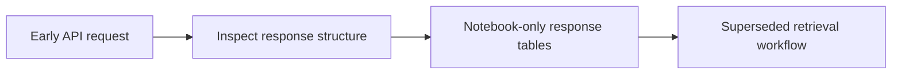

# Legacy Massive API Entitlement Check

**Executable:** `notebooks/legacy/API-initial.ipynb`  
**Status:** Legacy exploratory work retained for provenance.

## Purpose

I used this early notebook to understand which underlying, index and option endpoints were available for the dissertation.

## Workflow

## Inputs

- Massive API credentials
- Recent test dates and tickers

## Processing and rationale

- Call a small number of aggregate, contract and option endpoints.
- Display response tables and interpret subscription limitations.

## Outputs

- Displayed API response tables; no required persistent research output

## Representative outputs

No maintained research artifact is produced. The response tables remain in the [legacy notebook](../../../notebooks/legacy/API-initial.ipynb) as provenance only.

## Findings and decisions

- The experiment clarified that contract and aggregate access does not imply historical Greeks, implied volatility or open-interest access.

## Limitations

- It is an early entitlement check, not the final retrieval pipeline.
- API plans and history windows can change.

## Next steps

- Use the maintained database notebooks and `scripts/massive_database.py` for reproducible collection.
