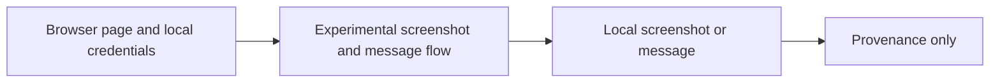

# Legacy Gamma-Exposure Browser Experiment

**Executable:** `notebooks/legacy/disc-gamma.ipynb`  
**Status:** Legacy exploratory work retained for provenance.

## Purpose

I used this short experiment to test browser capture and Discord delivery for a public gamma-exposure page.

## Workflow

## Inputs

- Public Barchart page
- Local `DISCORD_WEBHOOK_URL` when delivery is enabled

## Processing and rationale

- Open the page with Playwright, capture an image and optionally post it to Discord.

## Outputs

- A local screenshot and optional Discord message

## Representative outputs

Any screenshot or message was local and is not dissertation evidence. The implementation remains in the [legacy notebook](../../../notebooks/legacy/disc-gamma.ipynb) for provenance.

## Findings and decisions

- The browser method was exploratory and was not adopted as a reliable dissertation data source.

## Limitations

- Page structure and anti-automation controls can change.
- The image is not a structured or historically reproducible dataset.

## Next steps

- Use licensed API data for the main research pipeline.
