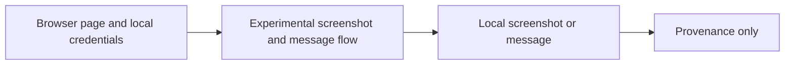

# Legacy Gamma-Exposure Browser Experiment

**Executable:** `notebooks/legacy/disc-gamma.ipynb`  
**Status:** I kept this as provenance from an older experiment. It isn't part of the final dissertation evidence.

## Purpose

I made this quick experiment to see whether I could capture a public gamma page and send the image to Discord.

## Workflow

## Inputs

- Public Barchart page
- Local `DISCORD_WEBHOOK_URL` when delivery is enabled

## Processing and rationale

- I open the page with Playwright, take a screenshot and optionally send it through a Discord webhook.

## Outputs

- A local screenshot and optional Discord message

## Representative outputs

Any screenshot or message was local and is not dissertation evidence. The implementation remains in the [legacy notebook](../../../notebooks/legacy/disc-gamma.ipynb) for provenance.

## Findings and decisions

- It worked as a browser experiment, but I didn't trust it enough to use as a dissertation data source.

## Limitations

- The page or its anti-automation behaviour can change at any time.
- A screenshot isn't structured historical data and is hard to reproduce later.

## Next steps

- I use licensed API data for the actual research workflow.
