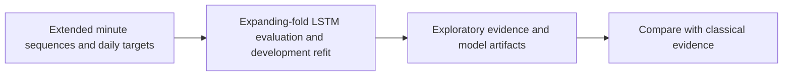
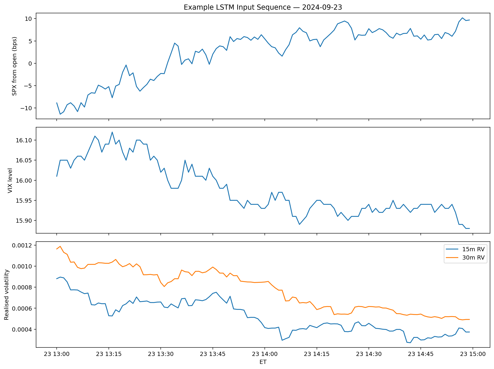
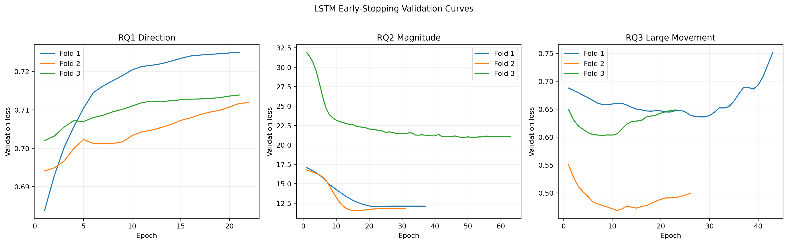

# LSTM Intraday Sequence Extension

**Executable:** `notebooks/lstm_intraday_sequence_extension.ipynb`  
**Status:** Part of the maintained dissertation workflow.

## Purpose

I test whether a small LSTM using the ordered 13:00-14:59 minute path adds information beyond engineered tabular features.

## Workflow

## Inputs

- Extended aligned one-minute data
- Extended strict daily split dataset
- Classical tuned-model outputs

## Processing and rationale

- Build 120-minute sequences with 16 price, volatility, volume, alignment and time features.
- Scale inside each chronological outer fold and use the final training portion for early stopping.
- Evaluate RQ1, RQ2 and RQ3 without using the existing test or future holdout.

## Outputs

- `outputs/extended_2023_2026/lstm_sequence_extension/`
- LSTM fold, prediction, importance, history and manifest files

## Representative outputs

*Figure: the minute-by-minute channels presented to the sequence model before the decision time.*

*Figure: the chronological training and validation behaviour used to assess overfitting and choose epochs.*

## Findings and decisions

- The LSTM is retained as an exploratory extension rather than a replacement for the classical models.
- The fixed small architecture and time-aware evaluation prevent a large post-hoc neural-network search.
- Its outputs allow direct overlap and metric comparisons with the classical winners.

## Limitations

- The sample is small for deep learning and results can depend on training randomness.
- The sequence design excludes options-derived variables and is not evaluated on a fresh holdout.

## Next steps

- Compare the LSTM and classical models conservatively, then keep the simpler specification unless sequence modelling gives stable gains.
