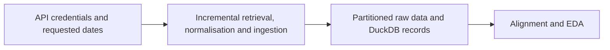

# Massive Raw Data Retrieval

**Executable:** `notebooks/massive_database_raw_retrieve.ipynb`  
**Status:** Part of the maintained dissertation workflow.

## Purpose

I retrieve the dissertation's underlying and selected option history incrementally and register it for later analysis.

## Workflow

## Inputs

- `main.env` with `MASSIVE_API_KEY`
- Massive API
- Retrieval dates and ticker configuration

## Processing and rationale

- Download SPY, SPX and VIX minute aggregates by business day.
- Normalise timestamps and write partitioned Parquet files.
- Discover SPX contracts, collect permitted snapshots or samples and update DuckDB views.

## Outputs

- `data/raw/`
- `data/market.duckdb`
- DuckDB ingestion log

## Representative outputs

The maintained downstream audit is stored as [underlying session audit Parquet](../../data/derived/underlying_session_audit.parquet), while the raw retrievals remain in date-partitioned files below `data/raw/`.

## Findings and decisions

- The collection is restartable because successful ticker-date requests are logged and skipped on rerun.
- API errors and empty sessions remain explicit for later quality review.

## Limitations

- Historical Greeks, open interest and quote-level bid-ask data are not backfilled by this workflow.
- Long downloads depend on API entitlements, rate limits and network availability.

## Next steps

- Run alignment and EDA after the required underlying views are available.
