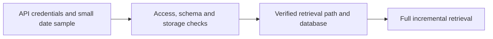

# Massive Database Starter

**Executable:** `notebooks/massive_database_starter.ipynb`  
**Status:** I use this in the main dissertation workflow.

## Purpose

I use this as a small test run before starting a full download. It checks what the Massive account can actually access and whether the Parquet/DuckDB storage works as expected.

## Workflow

## Inputs

- `main.env` with `MASSIVE_API_KEY`
- Massive aggregate, contract and snapshot endpoints

## Processing and rationale

- I try a few recent underlying requests and check the option entitlements.
- I save a small sample and make sure DuckDB can see it.
- I also test contract discovery, chain snapshots and one controlled option-bar example.

## Outputs

- `data/raw/`
- `data/market.duckdb`
- Ingestion-log and access-check tables displayed in the notebook

## Representative outputs

The successful storage path feeds the [underlying session audit Parquet](../../data/derived/underlying_session_audit.parquet) and the local `data/market.duckdb` database.

## Findings and decisions

- If an endpoint returns nothing, the notebook shows that clearly instead of pretending the request worked.
- Successful dates are logged, which makes later reruns much easier.
- The storage layout tested here is the same one used in the rest of the project.

## Limitations

- What works depends on the Massive subscription and its rolling history window.
- Getting rows back for a test date doesn't guarantee that every full session is complete.

## Next steps

- I only move to the full retrieval notebook after these small checks work.
