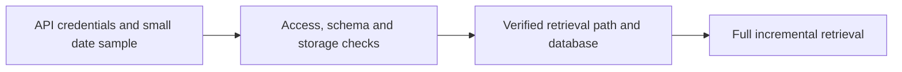

# Massive Database Starter

**Executable:** `notebooks/massive_database_starter.ipynb`  
**Status:** Part of the maintained dissertation workflow.

## Purpose

I validate Massive access and test the incremental Parquet and DuckDB storage workflow before a full download.

## Workflow

## Inputs

- `main.env` with `MASSIVE_API_KEY`
- Massive aggregate, contract and snapshot endpoints

## Processing and rationale

- Probe recent underlying data and option entitlements.
- Download a small proof-of-concept sample and register DuckDB views.
- Test contract discovery, chain snapshots and a controlled option-bar sample.

## Outputs

- `data/raw/`
- `data/market.duckdb`
- Ingestion-log and access-check tables displayed in the notebook

## Representative outputs

The successful storage path feeds the [underlying session audit Parquet](../../data/derived/underlying_session_audit.parquet) and the local `data/market.duckdb` database.

## Findings and decisions

- The notebook makes access limitations visible instead of treating empty results as valid data.
- Successful sessions are logged so reruns can skip completed downloads.
- It establishes the storage convention used by the rest of the project.

## Limitations

- Endpoint access depends on the current Massive subscription and rolling history window.
- A successful probe does not prove that every session is complete.

## Next steps

- Run the full retrieval notebook only after the proof-of-concept checks pass.
