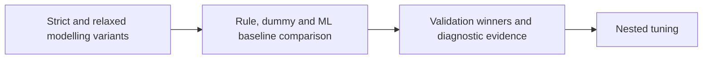

# Underlying Baseline Models for RQ1-RQ3

**Executable:** `notebooks/modeling_baseline.ipynb`  
**Status:** Part of the maintained dissertation workflow.

## Purpose

I compare rule-based, dummy and machine-learning baselines for direction, magnitude and large-movement prediction.

## Workflow

## Inputs

- Strict and relaxed chronological split datasets
- Frozen full and reduced feature sets

## Processing and rationale

- Evaluate classification and regression families with expanding-window validation.
- Compare RQ1 with persistence, momentum and mean-reversion rules.
- Measure RQ3 permutation importance and feature-group importance.

## Outputs

- `outputs/baseline_models/tables/`
- `outputs/baseline_models/figures/`
- `outputs/baseline_models/validation_research_question_summary.json`

## Representative outputs

*Figure: the relaxed-sample RQ1 comparison between rule, dummy and machine-learning baselines.*

*Figure: the validation-period feature groups associated with identifying larger final-hour moves.*

## Findings and decisions

- The relaxed Extra Trees model reached 0.600 validation balanced accuracy for RQ1, only slightly above the 0.595 mean-reversion rule.
- Relaxed Elastic Net improved RQ2 validation MAE by about 1.32 bps over the dummy benchmark.
- Strict K-nearest neighbours improved RQ3 average precision over the large-move prevalence, with volume and VWAP as the leading feature group.

## Limitations

- The validation sample is small and model rankings may be regime-sensitive.
- The baseline test period was inspected, so it is not fresh evidence for later tuning choices.

## Next steps

- Tune a limited set of model families with nested expanding-window validation.
