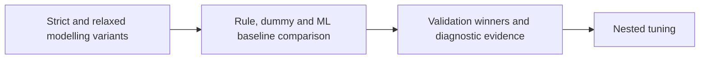

# Underlying Baseline Models for RQ1-RQ3

**Executable:** `notebooks/modeling_baseline.ipynb`  
**Status:** I use this in the main dissertation workflow.

## Purpose

I start with simple rules, dummy models and a few standard machine-learning models here. This gives me something sensible to beat for direction, magnitude and large-move prediction.

## Workflow

## Inputs

- Strict and relaxed chronological split datasets
- Frozen full and reduced feature sets

## Processing and rationale

- I compare the classification and regression models with expanding-window validation.
- For RQ1, I also include persistence, momentum and mean-reversion rules.
- For RQ3, I look at permutation importance and broader feature groups so the result isn't just a score.

## Outputs

- `outputs/baseline_models/tables/`
- `outputs/baseline_models/figures/`
- `outputs/baseline_models/validation_research_question_summary.json`

## Representative outputs

*This plot shows the relaxed-sample RQ1 comparison between rule, dummy and machine-learning baselines.*

*This plot shows the validation-period feature groups associated with identifying larger final-hour moves.*

## Findings and decisions

- Relaxed Extra Trees reached 0.600 balanced accuracy for RQ1, only just above the 0.595 mean-reversion rule.
- Relaxed Elastic Net improved the RQ2 validation MAE by about 1.32 bps against the dummy result.
- For RQ3, strict K-nearest neighbours beat the large-move prevalence on average precision, with volume and VWAP leading the feature groups.

## Limitations

- The validation period is small, so the model ranking could change in another market regime.
- I had already looked at the baseline test period, which means it can't be treated as fresh evidence during tuning.

## Next steps

- I take a small shortlist forward and tune it with nested expanding-window validation.
