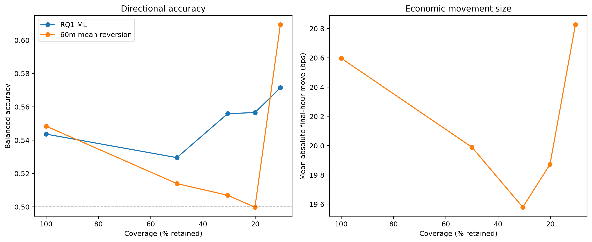
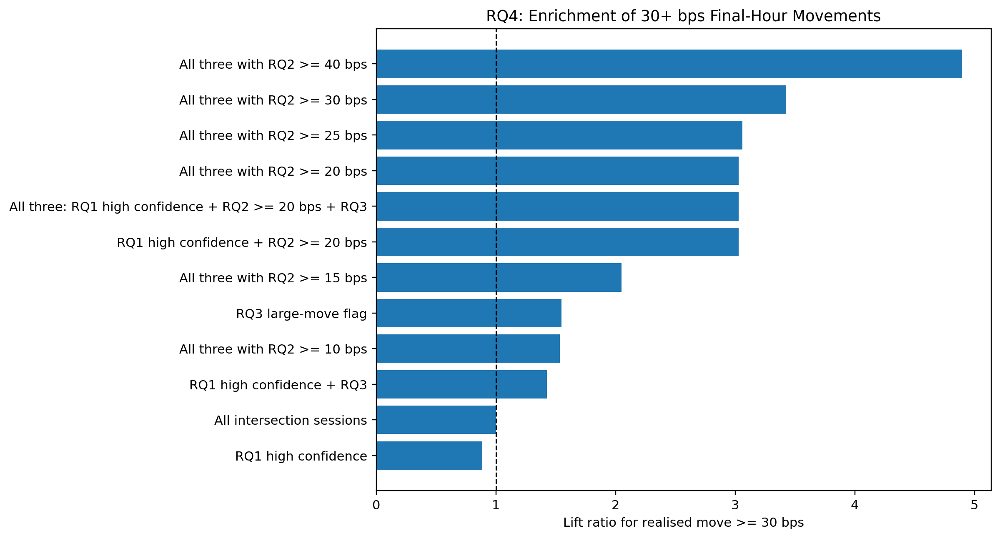

# Extended-History RQ4 Economic Meaningfulness

**Executable:** `notebooks/rq4_economic_meaningfulness_extended.ipynb`  
**Status:** Part of the maintained dissertation workflow.

## Purpose

I repeat the RQ4 opportunity analysis using the isolated extended-history modelling outputs.

## Workflow

## Inputs

- Extended selected-winner predictions
- Extended strict and relaxed datasets
- Extended tuning outputs

## Processing and rationale

- Apply the same confidence, magnitude and large-move analyses used in the main RQ4 notebook.
- Compare opportunity lift, regimes and uncertainty without changing the original outputs.

## Outputs

- `outputs/extended_2023_2026/rq4_economic_meaningfulness/`

## Representative outputs

*Figure: the same confidence-versus-opportunity relationship on the extended history.*

*Figure: the extended-period lift for moves of at least 30 basis points.*

## Findings and decisions

- This run provides a history-extension sensitivity check under the same RQ4 interpretation rules.
- I keep its conclusions separate from the original project results and from any future untouched holdout.

## Limitations

- The extended sample was still used for development and model selection.
- Option-level profitability remains outside this notebook.

## Next steps

- Compare the original and extended RQ4 conclusions, then retain only pre-specified signals for RQ5.
