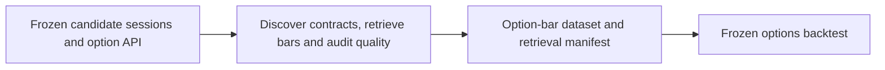

# RQ5 SPX 0DTE Option Data Retrieval

**Executable:** `notebooks/rq5_options_data_retrieval.ipynb`  
**Status:** I use this in the main dissertation workflow.

## Purpose

This is the data-collection part of RQ5. I lock the candidate dates first, find the matching same-day SPX contracts and then download the minute bars needed for the backtest.

## Workflow

## Inputs

- RQ4 combined outer-fold predictions
- Massive API credentials
- Frozen confidence, magnitude and large-move filters

## Processing and rationale

- I choose the candidate sessions before looking at any option outcome.
- For each date I find the ATM contract plus calls and puts 5-30 points out of the money.
- I download the 14:55-16:00 bars and check whether the planned entry and exit windows are actually usable.

## Outputs

- `outputs/rq5_options_trading/raw/rq5_option_minute_bars.parquet`
- Contract-selection, download-log, quality and candidate-session tables
- `outputs/rq5_options_trading/rq5_retrieval_manifest.json`

## Representative outputs

The retrieved minute bars are stored in [Parquet format](../../outputs/rq5_options_trading/raw/rq5_option_minute_bars.parquet), with scope and data-quality decisions in the [retrieval manifest](../../outputs/rq5_options_trading/rq5_retrieval_manifest.json).

## Findings and decisions

- The saved run collected 15,279 option-minute rows.
- Seventeen calls and seventeen puts were usable at every strike offset I tested. Three earlier contracts on each side had no bars.
- The backtest uses these saved contracts, so it can't rediscover a better one after seeing the P&L.

## Limitations

- The aggregate bars come from trades and aren't historical NBBO quotes.
- Because Massive has a rolling history window, older candidate dates can disappear from the API.

## Next steps

- I now apply the entry, exit, cost and comparator rules that were fixed before the backtest.
