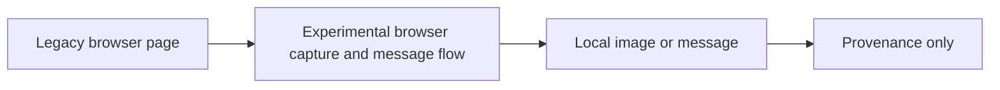

# Legacy Gamma Chart Capture

**Executable:** `scripts/legacy/disc-gamma-svg.py`  
**Status:** I kept this as provenance from an older experiment. It isn't part of the final dissertation evidence.

## Purpose

I changed the earlier browser script so it captures just the Highcharts SVG instead of taking a screenshot of the whole page.

## Workflow

## Inputs

- The public NVDA gamma-exposure webpage.
- `DISCORD_WEBHOOK_URL` loaded locally from `main.env`.
- A Playwright Chromium installation.

## Processing and rationale

- I open the page, deal with the cookie box if it appears and wait for the SVG.
- I hide overlays that cover the chart, but I don't change the chart data.
- I crop to the chart and optionally send it through the webhook.

## Outputs

- A local, untracked browser capture when the experiment is run.
- An optional Discord message containing the chart; neither item is maintained dissertation evidence.

## Representative outputs

No maintained artifact is expected. The experimental implementation remains in the [legacy script](../../../scripts/legacy/disc-gamma-svg.py) as provenance only.

## Findings and decisions

- The cropped version looked much cleaner than the full-page screenshot.
- I still keep it as an old experiment because it doesn't give me stable historical observations.

## Limitations

- The CSS selectors and chart code can change without warning.
- An image of a chart can't replace contract or quote data.

## Next steps

- I don't use this script as an input to the maintained models.
