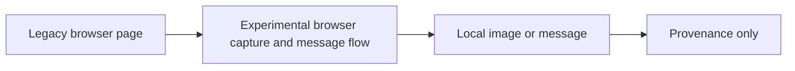

# Legacy Gamma Chart Capture

**Executable:** `scripts/legacy/disc-gamma-svg.py`  
**Status:** Legacy exploratory work retained for provenance.

## Purpose

I refined the earlier browser experiment so that it captures only the Highcharts SVG area rather than the complete page.

## Workflow

## Inputs

- The public NVDA gamma-exposure webpage.
- `DISCORD_WEBHOOK_URL` loaded locally from `main.env`.
- A Playwright Chromium installation.

## Processing and rationale

- Open the page, handle the optional cookie prompt and wait for the SVG chart.
- Remove overlays that can cover the chart without changing its data.
- Capture only the chart and upload it through the configured webhook.

## Outputs

- A local, untracked browser capture when the experiment is run.
- An optional Discord message containing the chart; neither item is maintained dissertation evidence.

## Representative outputs

No maintained artifact is expected. The experimental implementation remains in the [legacy script](../../../scripts/legacy/disc-gamma-svg.py) as provenance only.

## Findings and decisions

- Cropping to the SVG produced a cleaner exploratory artefact than a full-page image.
- I still treat the method as provenance only because it does not provide stable historical observations.

## Limitations

- CSS selectors and the chart implementation can change without notice.
- The captured chart cannot replace contract-level or quote-level source data.

## Next steps

- Do not use this browser experiment as input to the maintained dissertation models.
